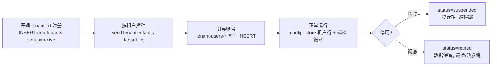

# 配置中心租户隔离改造设计（方案 B：全部数据每租户自有）

- 日期：2026-09-03
- 状态：设计稿（待评审）
- 适用版本：CRM-ai-native（Node22 + ESM + PG16 + Express4）
- 关联文档：docs/2026-08-31-multi-tenant-design.md（多租户设计枢轴 4）、docs/2026-08-31-config-center-design.md（配置中心聚合设计）

## 1 背景与目标

### 1.1 背景

- config.html 是配置中心聚合页，聚合 18 项配置；清单定义于 `src/portal/configCenter.js:8-49`（CONFIG_ITEMS）。
- 多租户方案 B 已拍板（2026-09-03）：**全部数据每租户自有**；租户用户只读本租户，admin 通配 `'*'` 可见全部。
- 基础设施已具备：JWT claim `tenantId`（`src/http/auth.js:44,53`）、读作用域 `scopeTenant(me)`（`src/http/tenantScope.js:4-7`）、写作用域 `scopeOf(me)`（`tenantScope.js:10-12`）、config_store PK `(tenant_id, key)`（`db/migrate-tenant.js:23`）、`readConfig` 租户优先回退 system（`src/config/configStore.js:10-23`）、粒子层按租户过滤（`src/particles/particleRepo.js:158-174`）。
- 但存在三大核心缺口：**无租户注册表、按租户播种未产品化、运行期消费断层（裸 SQL / 固定 system 绕过租户层）**。

### 1.2 改造目标

1. **18 项配置隔离语义明确**：每项声明 `scope:'platform'|'tenant'`，写入声明 schema，杜绝"哪项该隔离、哪项共享"靠人记忆。
2. **按租户可配**：租户级配置经 `readConfig(key,{tenantId})` 租户优先回退 system；平台级配置固定只读 system。
3. **巡检/定时器按租户生效**：所有裸 SQL 消费点（timers/upload/financeAlertHook 等）补租户条件或改走 readConfig，消灭绕过租户层的断层。
4. **租户生命周期可管理**：crm.tenants 注册表 + 开通→播种→停用流程（停用=status 字段，禁 DELETE）。

## 2 18 项配置租户语义分类总表

分类依据：**消费方证据**（消费方如何读、是否已有租户条件）。平台级=全局共享一份；租户级=每租户自有、未覆盖回退 system；混合/断层=应租户级但存在缺口，本改造重点修复。

### 2.1 平台级（全局共享，固定只读 system）

| id | 名称 | 存储载体 | 消费方证据 | 建议隔离语义 | 改造动作 |
|----|------|----------|-----------|--------------|----------|
| 11 | LLM 配置 | config_store `llm` | `src/llm/client.js:25` 固定 `{tenantId:'system'}`；llm_config 表亦无租户列 | platform | 不变（声明 platform，configRouter 只读 system） |
| 16 | 方法论 SKILL 注册表 | skill_registry 表（无 tenant 列） | `src/skills/skillRegistry.js:68` 全表查询无租户条件 | platform | 不变（声明 platform） |
| 23 | 智能体配置 | 代码层 agentSpec | `src/agent/agentSpec.js:3-28` 纯代码声明 | platform | 不变（声明 platform） |
| 33 | 销售决策思维要素 | thinkingTemplates 代码只读 | `src/decision/thinkingTemplates.js` 代码只读 | platform | 不变（声明 platform） |
| 37 | 审计链巡检 | config_store `provenance-patrol` | `src/scheduler/timers.js:281` 固定 system；`src/decision/provenance.js:223-230` patrolChains 全表巡检 | platform | 不变（声明 platform） |

### 2.2 租户级（每租户自有，未覆盖回退 system）

| id | 名称 | 存储载体 | 消费方证据 | 建议隔离语义 | 改造动作 |
|----|------|----------|-----------|--------------|----------|
| 12 | 用户管理 | crm_users（带 tenant_id 列） | `db/migrate-tenant.js:8`；`src/http/auth.js:37-44` 登录按 tenant_id | tenant | 不变（声明 tenant） |
| 14 | 决策场景 | decision_scenario（带 tenant_id 列） | `db/migrate-tenant.js:13`；`src/action/executor.js:25` 租户回退；`src/http/decisionReadRoutes.js:56` **读 API 无租户条件** | tenant + resolve `tenant-first` | **补租户条件（T7）** |
| 15 | 七维设计 | config_store `seven-dim` | `src/calibration/knobs/sevenDimConfigStrategy.js:15`、`src/decision/relation.js:18`、`src/decision/traceRootCause.js:98` 均裸 SQL 无租户条件 | tenant + resolve `tenant-first` | **裸 SQL 改 readConfig（T5）** |
| 17 | 审批流 | CRM_APPROVAL_* 粒子（带 tenant_id） | `src/particles/particleRepo.js:158-174` 按租户过滤；`src/http/configRouter.js` 通用面 | tenant | 不变（声明 tenant） |
| 19 | 粒子属性 Schema | meta_attr（带 tenant_id，可扩展，2026-09-03 刚补） | `db/migrate.js` 种子 system 基线；`src/metaAttr/metaAttrRepo.js:55,90` getMetaAttr(listMetaAttr) 已按 tenant_id 过滤 | tenant + resolve `tenant-first` | 不变（声明 tenant） |
| 20 | 池配置 | config_store `pool-config` | `src/http/configRouter.js` 通用面 | tenant | 经 configRouter 自动生效 |
| 21 | 预警规则 | config_store `alert-rules` | 通用 configRouter | tenant | 经 configRouter 自动生效 |
| 24 | 门户/页面生成配置 | page schema / NL 模板 | 通用面 | tenant | 经 configRouter 自动生效 |
| 26 | 记忆/先例 | memory 表（带 tenant_id）+ decision 表 | `db/migrate-tenant.js:14`；`src/decision/decisionRepo.js:195,243` 落 tenant_id | tenant | 不变（声明 tenant） |
| 31 | 销售行为标准 | config_store `behavior-standard` | `src/http/behaviorStandardRouter.js:20,34` 按 scopeTenant/scopeOf | tenant | 经 configRouter 自动生效 |
| 32 | 判定阈值 | config_store `sales-thresholds` | HTTP 面按租户：`src/http/routes.js:312,820` readTenantConfig→scopeTenant；**但 timers.js:158/163 与 upload.js:20 裸 SQL（无租户条件）** | tenant | **修复消费断层（T3）** |
| 38 | 先例检索 | config_store `precedent-conf` | `src/decision/precedentScoring.js:95` 按租户读；**粗召回 SQL `decisionRepo.js:507-514` 无 tenant 条件** | tenant + resolve `tenant-first` | **补租户条件（T6）** |

> 表中 id 18「业务分级」为 config_store `business-tier-config`（见 configCenter.js:18），经通用 configRouter 承载，租户级自动生效——该行并入 id 20/21 的"经 configRouter 自动生效"组。

> 说明：id 15（七维）与 id 32/30/29 的区别在于其消费方（calibration / relation / traceRootCause）是内部处理器，无 HTTP 请求上下文（无 me），必须显式传租户；归入修复清单 T5。

### 2.3 混合/断层（本改造重点修复）

| id | 名称 | 存储载体 | 现状（证据） | 建议隔离语义 | 改造动作 |
|----|------|----------|-------------|--------------|----------|
| 29 | 财务应收 | config_store `finance-receivables` | HTTP 面租户级：`src/http/financeReceivablesConfigRouter.js:26,34`；**告警钩子固定 system：`src/alerts/financeAlertHook.js:25`** | tenant | **修复钩子租户化（T2）** |
| 30 | 指名客户目标 | config_store `named-account-targets` | HTTP 租户级：`src/http/namedAccountTargetsRouter.js:28,40`；**timers.js:163 裸 SQL 无租户** | tenant | **修复定时器（T3）** |
| 34 | 审批业务参数 | config_store `approval-config` | 通用 configRouter | tenant | 经 configRouter 自动生效 |
| 35 | 事件触发复盘 | config_store `event-retro` | **配置体固定 system：`src/decision/retroTrigger.js:38`**；执行按决策租户：`retroTrigger.js:47-63` loadDecisionMeta、`:102` createTask 带 tenantId | tenant + resolve `tenant-first`（配置读按决策租户） | **修复配置读（T5）** |
| 36 | 场景路由 | config_store `context-routing` | **routing.js:70-83 loadRouting 已支持 tenantId，但装配链路 `src/context/assembler.js:127` 未传 tenantId** | tenant | **修复装配链路（T4）** |
| 39 | 事件触发派发 | config_store `agent-event-trigger` | 读按租户：`src/agent/eventTrigger.js:39,138`；派发带租户：`:109-124`；**去重 :97 与 resolveDedupValue :55 无租户条件** | tenant | **补去重租户条件（T8）** |

### 2.4 三栏汇总

- 平台级 5 项：11、16、23、33、37（共享一份，只读 system）。
- 租户级 10 项：12、14、15、17、19、20、21、24、26、31、32、38（每租户自有，回退 system）。
- 混合/断层需修复 5 项：29、30、35、36、39（修复后均为"租户级 + 显式传租户的消费方"）。

## 3 架构设计

### 3.1 配置声明 schema（CONFIG_ITEMS 增补字段）

在 `src/portal/configCenter.js` 的 CONFIG_ITEMS 每项增加两个可空字段：

```js
{ id: 11, scope: 'platform', resolve: 'system-only', ... }           // 平台级：只读 system
{ id: 32, scope: 'tenant',   resolve: 'tenant-first', ... }          // 租户级：租户行优先，回退 system
// resolve 可空默认：
//   scope='platform' → 'system-only'
//   scope='tenant'   → 'tenant-first'
```

- `scope:'platform'`：该配置只存在/只读 system 一份；configRouter GET/PUT 一律固定 `{tenantId:'system'}`，与 scopeTenant/scopeOf 无关。
- `scope:'tenant'`：configRouter 走现有 scopeTenant/scopeOf（租户优先回退 system），不加显式条件即满足。
- 表格化展示（消费方视角）：

| scope | resolve | 读语义 | 写语义 | 典型项 |
|-------|---------|--------|--------|--------|
| platform | system-only | 恒读 (system,key) | 恒写 (system,key) | 11、16、23、33、37 |
| tenant | tenant-first | 先 (tenantId,key)，无则回退 (system,key) | 写 (scopeOf(me),key) | 12、14、15、17、19、20、21、24、26、29、30、31、32、34、35、36、38、39 |

> 设计要点：configRouter **不新增分支代码量**——现有实现 `configRouter.js:71,121` 已用 scopeTenant/scopeOf；只需在 createConfigRouter 处新增一行 `const tenantId = scope==='platform' ? 'system' : scopeTenant(me)` 的判定（T1）。

### 3.2 configRouter 改造点

现状：

- GET `src/http/configRouter.js:71`：`D.readConfig(key, { tenantId: scopeTenant(me) })` —— admin 通配 `'*'` 时 readConfig 会先查 `(tenantId='*', key)` 无行再回退 `(system,key)`，语义正确但隐含依赖回退。
- PUT `:121`：`D.writeConfig(key, nextValue, ..., { tenantId: scopeOf(me) })` —— admin 永远写自身租户（system），禁写 `'*'`。

改造点：

1. createConfigRouter 签名扩展：`{ key, role, decisionScene, secretFields, scope='tenant', resolve='tenant-first' }`。
2. GET/PUT 中把 `scopeTenant(me)` 替换为：
   ```js
   const tenantId = (scope === 'platform') ? 'system' : scopeTenant(me);
   // PUT 侧：scope==='platform' 恒 'system'；否则 scopeOf(me)（保持现逻辑）
   ```
3. 平台级配置（llm/skill-registry/agent-config/thinking-templates/provenance-patrol）由各专用路由显式传 `'system'`（多数已如此，如 `llm/client.js:25`、`timers.js:281`），configRouter 声明兜底。
4. 副作用：`configSummary`（`configCenter.js:64-79`）与 fetch 逻辑不变——端点仍按 key 查询，隔离语义由后端声明驱动。

### 3.3 消费方修复清单

逐文件给出：现状 / 改法 / 影响面。

| 文件:行 | 现状 | 改法 | 影响面 |
|---------|------|------|--------|
| `src/scheduler/timers.js:158-159`（⑤ sales-daily-scan） | `SELECT value FROM config_store WHERE key='sales-thresholds'` 裸 SQL，无租户条件 → 全库只读到第一条（通常 system） | 改 `readConfig('sales-thresholds',{tenantId})`；且外层粒子扫描 **补 `AND tenant_id=$n`** 后逐租户循环执行（伪代码见 3.3.1） | 巡检阈值按租户生效；告警归属正确租户 |
| `src/scheduler/timers.js:163-164`（同⑤ annual_target） | `WHERE key='named-account-targets'` 裸 SQL | 同上改 readConfig，随租户循环 | 同上 |
| `src/scheduler/timers.js:196`（⑥ named-visit-scan） | `WHERE type='CRM_ACCOUNT'` 粒子扫描缺 tenant_id 条件 | 补 `AND tenant_id=$1`，随租户循环 | 应访逾期按租户判红 |
| `src/scheduler/timers.js:198-204`（⑥ th/tg 读配置） | `WHERE key='sales-thresholds'` / `'named-account-targets'` 裸 SQL | 改 readConfig 双键 | 同上 |
| `src/scheduler/timers.js:281`（⑨ patrol） | 固定 `{tenantId:'system'}` + patrolChains 全表 `SELECT DISTINCT decision_id ... ORDER BY decision_id`（`provenance.js:227-230`） | 平台级保持 system（审计链是平台治理面）；**patrolChains 增加 tenant_id 参数**（可选，默认全表），巡检器按租户循环时传租户过滤 decision 列表 | 审计链巡检按租户隔离（可选增强，P2） |
| `src/assets/upload.js:20` | `WHERE key='sales-thresholds'` 裸 SQL（loadThresholds） | 改 `readConfig('sales-thresholds',{tenantId:a.tenantId})`；resolveActor 已带 tenantId（`:36`） | 上传大小阈值按租户 |
| `src/alerts/financeAlertHook.js:25` | `readConfig('finance-receivables', {tenantId:'system'})` 固定 system | 从事件载荷取 tenant：`msg.summary?.tenant_id || msg.tenant_id || 'system'`（checkOverdueAndEmit 的第二维 payload 携带租户） | 财务逾期天数阈值按租户 |
| `src/context/assembler.js:127` | `resolveTracks(scenarioId)` 未传 tenantId（routing.js:120 已支持 `{tenantId}`） | 改 `resolveTracks(scenarioId, { tenantId: scopeOf(actor) })`；actor 解析在 `assembler.js:149` 之后（safeActorRole），需前置解析 | 场景路由按租户生效 |
| `src/agent/eventTrigger.js:55` | resolveDedupValue 裸查 `particles WHERE id=$1` 无租户条件 | 补 `AND tenant_id=$2`（参数已可得：evPayload.tenant_id） | 去重键取值不串租户 |
| `src/agent/eventTrigger.js:97` | DB 去重 `tasks WHERE payload->>'dedup_key'=$1 AND status IN ('ready','running')` 无租户条件 | 补 `AND tenant_id=$2`（tryDispatch 已有 tenantId 入参，见 `:83,112`） | 同 dedup_key 跨租户防撞 |
| `src/http/decisionReadRoutes.js:56` | `decision_scenario WHERE scenario_id=$1` 无租户条件 | 补 `AND (tenant_id=$2 OR tenant_id='system') ORDER BY (tenant_id=$2) DESC LIMIT 1`（对齐 `src/action/executor.js:25` 已确立的租户优先回退范式），`$2=scopeOf(me)` | pre-context 读到本租户场景 |

#### 3.3.1 巡检按租户循环（改造后形态，伪代码）

```js
// timers.js ⑤/⑥ 改造后骨架（示意）
const tenants = await listActiveTenants();            // crm.tenants status='active'（T9）
for (const t of tenants) {
  const th = mergedThresholds(await readConfig('sales-thresholds', { tenantId: t.tenant_id }));
  const tg = mergedTargets(await readConfig('named-account-targets', { tenantId: t.tenant_id }));
  const rows = await query(
    `SELECT id, payload FROM crm.particles WHERE type=$1 AND tenant_id=$2`, [type, t.tenant_id]);
  // …原判定逻辑不变，告警携带 tenant_id 落 monitor_event
}
```

巡检器是"平台巡检器做租户循环"（platform 消费方读取 tenant 配置），不改变巡检本身只读+发射预警事件的性质。

### 3.4 租户注册表设计

#### 3.4.1 crm.tenants 表结构（建议）

```sql
CREATE TABLE IF NOT EXISTS crm.tenants (
  tenant_id   TEXT PRIMARY KEY,               -- 与 crm_users.tenant_id / particles.tenant_id 同源字符串
  name        TEXT NOT NULL,
  status      TEXT NOT NULL DEFAULT 'active' CHECK (status IN ('active','suspended','retired')),
  plan        TEXT,                            -- 可选：订阅档位（保留位）
  note        TEXT,
  created_at  TIMESTAMPTZ NOT NULL DEFAULT now(),
  suspended_at TIMESTAMPTZ,                    -- 停用时间戳（status='suspended' 时记录）
  retired_at  TIMESTAMPTZ                       -- 彻底下线时间戳（status='retired' 时记录）
);
CREATE INDEX IF NOT EXISTS ix_tenants_status ON crm.tenants (status);
```

- **禁 DELETE 铁律**：租户不可物理删除。停用 = `status='suspended'`（登录闸拒绝：`src/http/auth.js:36-40` 的 enabled 判定可与 crm.tenants.status 联查）；彻底下线 = `status='retired'`（仅保留数据，巡检/派发跳过 retired）。
- 种子：system 租户必须在表内（`INSERT ... ON CONFLICT DO NOTHING`），作为平台默认租户。
- 存量兼容：现有 `crm_users.tenant_id` 隐式字符串（acme-chem 等）通过迁移脚本 `INSERT INTO crm.tenants SELECT DISTINCT tenant_id, tenant_id, 'active' FROM crm.crm_users ON CONFLICT DO NOTHING` 灌入，不删除既有数据。

#### 3.4.2 生命周期（开通→播种→停用）



### 3.5 通用按租户播种器设计

#### 3.5.1 签名

```js
// db/seed/tenantDefaults.js（新建）
export async function seedTenantDefaults(tenantId, {
  salesThresholds = false,   // 是否写入判定阈值（默认回退 system，可选项）
  namedTargets = false,      // 指名客户目标
  ...
} = {}) {
  // ① 注册表登记（幂等）：INSERT INTO crm.tenants ... ON CONFLICT (tenant_id) DO NOTHING
  // ② 对齐 seedChemicalProfile 模式：writeConfig(key, value, { tenantId })（configStore.js:26-34 upsert）
  //    默认只写「必须按租户差异化」的键；其余键回退 system（租户优先回退天然成立，无需逐键复制）
  // ③ 返回 { ok, seededKeys[], skippedKeys[] }
}
```

- 对齐 `db/seed/tenant-profile-chemical.js:10-59` 的 `writeConfig('tenant-profile', {...}, {tenantId})` 模式（现有 3 个行业种子都采用）。
- **不复制 system 默认值**：只播种租户差异化键，其余靠 readConfig 回退 system——避免"复制一份默认值"的漂移风险（改 system 默认时租户副本不跟随）。

#### 3.5.2 migrate.js 默认配置种子的租户化改造

现状：`db/migrate.js:233-242` 的 `INSERT INTO crm.config_store (key, value) ... WHERE NOT EXISTS (...)` 不带 tenant_id → 走列默认 `'system'`（migrate-tenant.js:19-23 已把 DEFAULT 'system' 补上）。

改造：

1. migrate.js 现有 INSERT 保持（落 system 租户默认，语义正确）；
2. 新增 `seedTenantDefaults()` 在 `seed-all-tenants.mjs` 入口统一调用（`db/seed/seed-all-tenants.mjs:24-25` 现有 3 个行业种子之后追加）；
3. 新建租户流程 = `INSERT crm.tenants` → `seedTenantDefaults(tenantId)` → `tenant-users-*` 引导账号。

## 4 P0/P1/P2 优先级分层

| 优先级 | 项目 | 理由 |
|--------|------|------|
| **P0（先做，破坏隔离的数据正确性/越权风险）** | ① timers.js:158/163/196/198-204 裸 SQL（⑤⑥巡检） | 裸 SQL 无租户条件 = 巡检读到首位租户的配置应用给全部租户；数据正确性 + 越权（读他租户配置间接） |
| | ② upload.js:20 裸 SQL | 上传阈值按首位租户配置执行，跨租户 |
| | ③ financeAlertHook.js:25 固定 system | 告警阈值失去租户语义（租户 A 改了逾期天数，A 的告警不生效） |
| | ④ decisionReadRoutes.js:56 无租户条件 | 租户 A 读 API 可读到租户 B 的场景配置（读越权） |
| | ⑤ eventTrigger.js:55/97 无租户条件 | 跨租户 dedup 误判 + 去重键取值串租户（风暴防护错位） |
| | ⑥ configRouter platform 分支判定（T1） | 平台/租户声明落地，所有配置面的锚点 |
| **P1（隔离语义正确性但无越权）** | ① assembler.js:127 不传 tenantId | 场景路由全部回退 system，租户定制不生效（只影响"租户想差异化路由"时） |
| | ② retroTrigger.js:38 固定 system | 复盘配置不按租户（总开关/冷却窗全局）
| | ③ 七维消费方裸 SQL（sevenDimConfigStrategy.js:15 / relation.js:18 / traceRootCause.js:98） | 读配置无租户条件 → 回退漂移（消费方多无 HTTP 上下文，需显式传租户；当前无越权暴露面） |
| | ④ 种子租户化（migrate.js:233-242 → seedTenantDefaults） | 新租户流程产品化 |
| | ⑤ searchPrecedents 粗召回（decisionRepo.js:507-514）补 tenant 条件 | 先例检索跨租户串数据（P1：写通道已带租户，读侧粗召回缺条件） |
| **P2（运维面/增强）** | ① patrolChains 按租户（provenance.js:223-230） | 平台治理面，全表巡检语义正确但效率/隔离可增强 |
| | ② 租户注册表（crm.tenants）+ 生命周期脚本 | 运维控制台、种子入口的前置 |
| | ③ timers.js:281 巡检配置按租户循环 | 依赖注册表，紧随 P2-② |

## 5 验收标准（每个 P0/P1 改动的可验证行为）

| # | 改动 | 验收行为（可执行验证） |
|---|------|------------------------|
| V1 | configRouter platform 分支 | 租户 A 登录 GET `/api/config/sales-thresholds` 返回 A 的阈值；admin（通配）GET 同一 key 返回 system 默认；GET `/api/config/llm` 恒为 system 值（A 改不了 llm，PUT 落 system） |
| V2 | timers.js ⑤⑥ 巡检 | 租户 A 改 `sales-thresholds`，租户 B 不改：B 的 sales-daily-scan 仍按 B 回退的 system 阈值判定（且扫描只扫 B 的粒子）；A 的告警 target_role/payload 归属 A |
| V3 | upload.js:20 | 租户 A 改 `asset.max_mb`，B 不改：B 上传仍按 B 阈值（system 默认） |
| V4 | financeAlertHook.js:25 | 租户 A 改 `finance-receivables.payment_overdue_days`：A 的 payment_overdue_plan 事件按 A 阈值告警；B 不变 |
| V5 | decisionReadRoutes.js:56 | 租户 B 有 `scenario_id=quote` 专属行，租户 A 无：A 登录 `/api/decision/pre-context?scenario_id=quote` 读到 system 默认行；B 读到 B 行 |
| V6 | eventTrigger.js:55/97 | 租户 A、B 有同名 dedup_key 的任务：A 的派发不因 B 已有任务而跳过（反之亦然） |
| V7 | assembler.js:127 | 租户 A 改 `context-routing` 把 quote 场景改为只走 `structured`：A 装配 bundle.routing.tracks=['structured']；B 仍全轨 |
| V8 | retroTrigger.js:38 | 租户 A 关 `event-retro.enabled`：A 的决策确认不再建复盘待办；B 正常 |
| V9 | seedTenantDefaults | 新租户 X 走 `INSERT crm.tenants → seedTenantDefaults → tenant-users`：登录后 GET sales-thresholds 回退 system 值；改 A 不影响 X |
| V10 | 租户注册表生命周期 | suspended 租户登录被拒（401），其数据保留、巡检跳过、派发跳过；解挂后恢复 |

## 6 风险与回滚

| 风险 | 概率/影响 | 缓解 | 回滚 |
|------|-----------|------|------|
| 巡检器租户循环后告警量放大（N 租户 × 原 1 租户） | 中/低 | 循环沿用原有幂等告警（findOpenAlertByParticle 已有 open 不复发，timers.js:213-220） | 回滚 = 恢复裸 SQL（P0 改动单文件，git revert 即可） |
| decisionReadRoutes 补租户条件后，admin 通配 `'*'` 场景读不到（无 system 回退行） | 低/中 | 采用 executor.js:25 范式 `(tenant_id=$2 OR tenant_id='system')`：admin 传 `scopeOf(me)`（自身租户）而非 `'*'`——写文档明确 admin 读决策读模型用自身租户 | 同单文件回滚 |
| events 载荷无 tenant_id（financeAlertHook） | 中/中 | 探测 checkOverdueAndEmit 载荷（未在 scope）；兜底 `msg.tenant_id || msg.summary?.tenant_id || 'system'`，fail-open 不阻断 | 同单文件回滚 |
| 存量租户未注册（crm.tenants 为空）→ 巡检循环 0 租户 | 高/中 | T9 迁移：`INSERT SELECT DISTINCT tenant_id FROM crm_users` 先灌入；循环前断言至少 system 存在 | 删除 crm.tenants 行（禁 DELETE 铁律下用 status='retired' 反向治理） |
| platform 配置误声明 tenant → admin 写进自身租户而非 system | 低/高 | configRouter platform 分支强制 'system'；configCenter.js 注释 + 评审把关 | 改声明值 + 重跑播种 |

## 7 任务拆解清单

有序、含依赖、按实现顺序编号。

| 编号 | 任务 | 依赖 | 说明 |
|------|------|------|------|
| T1 | configRouter scope 声明 + platform 分支（configRouter.js:50-135） | 无 | createConfigRouter 签名加 `scope/resolve`，GET/PUT 按 platform 强制 system；CONFIG_ITEMS 补声明（configCenter.js:8-49） |
| T2 | 财务逾期告警钩子租户化（financeAlertHook.js:25） | T1 | 事件载荷取租户，readConfig 带租户；P0 |
| T3 | 巡检/上传裸 SQL 修复（timers.js:158/163/196/198-204、upload.js:20） | T1 | readConfig + 粒子扫描按租户循环；P0 |
| T4 | 场景路由装配链路传租户（assembler.js:127） | 无 | resolveTracks(scenarioId,{tenantId})；actor 租户前置解析；P1 |
| T5 | 七维/复盘消费方租户化（sevenDimConfigStrategy.js:15、relation.js:18、traceRootCause.js:98、retroTrigger.js:38） | T1 | 内部处理器显式传租户（缺上下文时回退 system）；P1 |
| T6 | 先例粗召回补租户条件（decisionRepo.js:507-514） | 无 | `AND tenant_id=$n`（回退 system 用 executor 范式）；P1 |
| T7 | 决策读路由场景租户条件（decisionReadRoutes.js:56） | 无 | executor.js:25 租户优先回退范式；P0 |
| T8 | 事件派发去重租户化（eventTrigger.js:55/97） | 无 | resolveDedupValue 与 DB 去重补 tenant_id；P0 |
| T9 | 租户注册表 crm.tenants + 种子迁移（新建 db/migrate-tenant-tenants 或并入 migrate-tenant.js） | 无 | 表结构 §3.4.1；存量 tenant_id 去重灌入；P2 |
| T10 | 通用播种器 seedTenantDefaults + seed-all-tenants 接入（新建 db/seed/tenantDefaults.js） | T9 | 签名 §3.5.1；对齐 writeConfig 模式；P1 |
| T11 | 巡检配置按租户循环（timers.js:281、provenance.js:223-230 patrolChains 加 tenant_id 参数） | T9 | 审计链按租户巡检（平台治理面，默认全表）；P2 |
| T12 | 新增租户全流程联测 + 验收脚本（V1–V10） | T1–T11 | 每项验收标准落成可执行脚本（参照现有 tmp_verify_* 模式） |

依赖说明：T9 前置 T10/T11；T2/T3/T5 依赖 T1（声明落地）；T4/T6/T7/T8 独立可并行；T12 收口所有验收。

## 8 自查

- 占位符：无（全部证据来自实际文件:行号核实）。
- 矛盾：§3.3 中 timers.js:281 巡检在「平台级分类表」列为 platform、在修复清单标注"P2 增强按租户"——二者不矛盾：平台级=配置值共享 system；巡检**执行**可按租户循环（配置仍读 system，粒度相反，已在 3.3.1 说明）。
- 歧义：id 18/24/34 未在 2.2 单列，已在表下注明确并入"通用 configRouter 自动生效"组，避免遗漏。
- 范围：不修改任何源码（纯设计文档）；未扩展 meta_attr 设计（已在 2.2 标注现有实现已按租户过滤）；未论证 LLM 多租户化（方案 B 下 LLM 属平台级，不隔离）。

---
*文档结束*