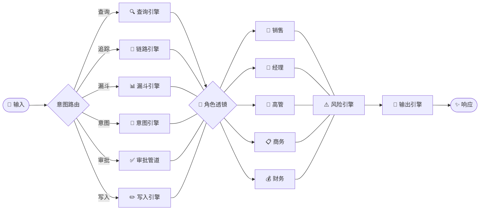
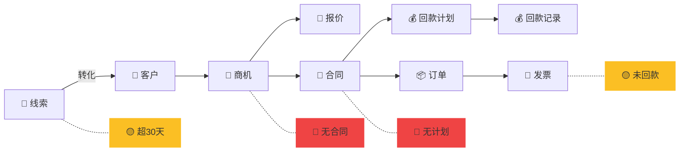

# 企业AI销售决策平台——总体架构设计

- 日期：2026-08-25
- 状态：设计评审稿（总体架构设计，已按 brainstorming 流程逐节确认，待用户评审后进入 writing-plans）
- 前置文档：`docs/2026-08-24-ai-native-sales-crm-design.md`（选型与借鉴设计，104KB，含 §2 选型/§3 三阶段/§4-§5 借鉴边界/§5ter 业务全景 19 小节/§5ter-quater 业务×能力映射/§6 技术底座对照/§6.1-6.4 Skills 系列实证/§7 待批准项）

本文档把既有选型文档升级为**可执行的总体架构**：四平面架构总图（§1）、10 大能力落位地图（§2）、粒子域全景（§3）、读写双通道数据流（§4）、三阶段落地边界与跨平面事件流（§5）、决策事件主轴（§6，顶层逻辑+实现基线，原两份 spec 已合并归入本节）。所有引用锚点（§编号）均指向既有设计文档。

---

## 1. 平台四平面架构总图

**核心主张**：AI 原生 CRM = **一份数据底座 + 四条接线平面**——粒子平面（事实源）、事件平面（横切接线）、智能体平面（执行）、门户平面（呈现）。10 大能力分别挂在这四个平面上，不是堆叠组件，而是各有明确挂点。

```
┌─────────────────────────────────────────────────────────────┐
│  L4 呈现平面 · Portal Plane（ai-portal-page-generation）      │
│  NL 对话 → 受控 Schema → 运行时渲染器（禁止 NL 直出 HTML）      │
│  菜单/工作台（四视角待办）/首页/统分机制/治理决策              │
└───────────────────────────┬─────────────────────────────────┘
                            │ 意图→Action / 结果回显
┌───────────────────────────▼─────────────────────────────────┐
│  L3 智能体平面 · Agent Plane（ai-multi-agent-orchestration）  │
│  agentLoop 引擎 + kanban 任务调度 + 角色（L4 注入配置）        │
│  执行 Action 表面（读直连/写过闸）→ 写结果再进事件总线          │
└───────────────────────────┬─────────────────────────────────┘
                            │ 写操作（action-confirm）
┌───────────────────────────▼─────────────────────────────────┐
│  L2 事件平面 · Event Plane（ai-event-driven-evolution）       │
│  SSE 事件总线 · 写操作 → 事件 → 本体构建/记忆/预警/审计/反馈    │
└───────────────────────────┬─────────────────────────────────┘
                            │ 粒子写事件（生命周期钩子）
┌───────────────────────────▼─────────────────────────────────┐
│  L1 粒子平面 · Particle Plane（ai-particle-system-design）    │
│  PostgreSQL + pgvector + 受控边表（edges）单库                │
│  （阶段 1 未用 Apache AGE；AGE 可选、阶段 3 视检索复杂度再评估） │
│  业务粒子（L2C）+ 支撑粒子（本体/记忆/事件/审批/规则）          │
│  写时向量构建（ai-ontology-vector-build）                      │
└─────────────────────────────────────────────────────────────┘
```

**四平面职责与 10 大能力挂点矩阵**：

| 平面 | 承载能力 | 职责边界 |
|---|---|---|
| 粒子平面 L1 | ai-particle-system-design / ai-ontology-vector-build /（记忆实体挂载） | 状态真相：写时构建本体+向量，粒子图即事实源 |
| 事件平面 L2 | ai-event-driven-evolution / ai-feedback-loop / ai-capability-audit | 横切接线：写事件驱动构建/记忆/预警/审计/反馈回路 |
| 智能体平面 L3 | ai-multi-agent-orchestration / ai-native-action-design /（ai-memory-lifecycle 运行侧） | 操作执行：agentLoop+kanban 派发，Action 表面读写 |
| 呈现平面 L4 | ai-portal-page-generation / ai-context-layering（L4 治理决策层） | 对话即门户：NL→Schema→渲染器，角色注入上下文 |

**关键接线不变量**（与 PDM 已验证底座同构，可直接复用）：
1. **一切业务写操作**（人/智能体/外部连接器）→ 统一进粒子写通道 → 触发粒子写事件 → 事件总线广播。
2. **本体/向量写时构建、记忆捕获、预警扫描、审计日志、反馈指标**全部挂粒子写事件，互不阻塞主事务。
3. **读操作**不写事件——读直连（默认），写入显式过闸（action-confirm + 审批流 HITL + 规则闸）。

---

## 2. 10 大能力 × 三阶段落位地图

**核心主张**：每个能力有且仅有一个「挂点平面 + 启动阶段 + 关键交付物」，不存在无主的 AI 能力堆叠。§5ter 业务域为每个能力提供输入检查清单。

| 能力 | 挂点平面 | 启动阶段 | 关键交付物 | 业务域输入（§5ter） |
|---|---|---|---|---|
| ai-particle-system-design | L1 | 阶段 1 | 粒子 Schema 全集（业务+支撑）、属性元模型、粒子生命周期钩子 | §5ter.1-10（L2C 九业务粒子） |
| ai-ontology-vector-build | L1 | 阶段 1 | 写时向量化管道、本体词汇表自动维护、去重/backfill | §5ter.4/17 定价链本体、§5ter.12 外部数据源写时校验 |
| ai-multi-agent-orchestration | L3 | 阶段 1 | agentLoop + kanban dispatch、任务状态机、并发限流 | §5ter.11 审批待办（四视角派发实证） |
| ai-context-layering | L4 | 阶段 2 | L1-L4 注入分层、检索通道与降级链、角色配置（五角色七要素） | §5ter.16 五角色定义 |
| ai-memory-lifecycle | L2+L3 | 阶段 2 | 记忆三构件（粒子图/快照/事件+推理）、30 天蒸馏 | §5ter.14 导入导出偏好记忆 |
| ai-native-action-design | L3 | 阶段 2/3 | Action Registry（命名空间分层）、写操作白名单、参数 Schema | §6.3 十一候选 SKILL、§6.3quater 二级资源命名空间 |
| ai-event-driven-evolution | L2 | 阶段 2/3 | SSE 事件总线、粒子写事件、预警规则（KPI 三档）、技能沉淀 | §5ter.1 线索池回收、§5ter.3 商机规则引擎（预警源） |
| ai-portal-page-generation | L4 | 阶段 2 | NL→Schema→运行时渲染器、四视角待办工作台 | §5ter.14 界面与设置、§5ter.11 我的待办 |
| ai-feedback-loop | L2 | 阶段 2/3 | 北极星指标、埋点、预期 vs 实际/计划 vs 记录对账 | §5ter.7 回款双表对账、§5ter.3 预期 vs 实际结束时间 |
| ai-capability-audit | L2 | 阶段 3 | 能力落地审计、外部调用审计日志入事件总线 | §5ter.13 安全底座、§5ter.4 价格变更日志 |

**阶段划分清晰化**：阶段 1 = 底座（粒子+本体+编排三能力接线）；阶段 2 = 认知+智能体层（上下文/记忆/Action/预警/门户/反馈六能力）；阶段 3 = 能力审计收口 + 业务闭环增量（审计能力 + 九业务粒子逐步落地）。与既有设计文档 §3 三阶段一致，差异是这里明确了**启动阶段**（能力在哪个阶段开始产出交付物）。

---

## 3. 粒子域全景（业务粒子 + 支撑粒子）

**核心主张**：粒子 = 全部「有状态的实体」的统一样式，分两类——**业务粒子**（L2C 上的业务真相）与**支撑粒子**（平台机制本身的业务对象化，保证审批流/规则/组织/技能都是可观测、可审计、可被 AI 操作的一等公民）。

### 3.1 业务粒子（L2C 主链路 + 定价链 + 协作域，对应 §5ter.1-10）

| 业务粒子 | 状态机/关键属性（§5ter 实证） | 关联域 |
|---|---|---|
| lead 线索 | 池归属（lead-pool）、领取/回收规则、转化→商机 | 线索池、跟进、标讯 |
| account 客户 | 联系人、公海（account-pool）、工商抬头（business-title） | 客户 360 聚合、企查查校验 |
| opportunity 商机 | 阶段-赢率-回退状态机（afootRollBack/endRollBack）、规则引擎、预计/实际结束时间 | 报价、漏斗、预警 |
| quotation 报价 | 商机关联 + 产品明细子表 + 金额计算规则（定价×折扣×税点）+ 审批生命周期 + 有效期 | product/price-list、contract |
| contract 合同 | 独立对象 + 审批生命周期 + 阶段看板 + 二级资源（payment-plan/payment-record/business-title/invoice） | quotation、order |
| payment-plan 回款计划 | 计划金额/应回时间/状态 →「应回」侧 | contract |
| payment-record 回款记录 | 实回金额/时间/凭证 →「实回」侧，计划 vs 记录对账 | contract、invoice |
| invoice 发票 | 票据信息 + 电子附件 + 关联抬头/回款，开票→回款→对账核销 | contract、payment |
| order 订单 | 独立对象 + 审批 + 状态看板 | contract |
| product / price-list 产品/价格表 | 四级定价链（产品→价格表 N 套定价→报价→合同）、价格有效期/权限/变更日志 | quotation |
| follow 跟进 | 计划→记录两态转化（converted）、终态保护（状态机合法流转校验）、评论树（parentId）+ @提及 | 跨对象（lead/account/opportunity）多态绑定 |

**定价四级链（§5ter.17 实证）**：`product` → `price-list`（N 套定价+有效期+权限+变更日志）→ `quotation`（自动填充+金额计算规则，累计金额自动汇总非手填）→ `contract`。

### 3.2 支撑粒子（平台机制业务对象化，对应 §5ter.11/12/13/14）

| 支撑粒子 | 用途 | 关键结构（实证） |
|---|---|---|
| particle-type / attr 元模型 | 动态模块化对象模型（新对象按配置长出来，非写死 CRUD 表） | §4.1 元模型 |
| organization / user / role | 组织 RBAC：organization_id 贯穿，parent_id 层级树（区域/子团队中间层） | §4.4、§6.3quater 区域维度 |
| approval-flow / instance / record 审批流 | HITL 引擎（覆盖报价/合同/发票/订单四大写域） | flow→version→node→approver→condition→link、会签/或签/顺序、兜底 AUTO_PASS、数据回滚补偿 |
| rule 规则引擎 | AI 写操作护栏（不能做什么的判定） | scope+operator+condition+auto+enable |
| event 事件 | 事件总线持久化（外部调用全量入总线与审计） | SSE 5 事件域（PDM 已验证） |
| memory 记忆粒子 | 记忆三构件实体（快照/推理/决策） | §3 阶段 2 |
| ontology / vector 本体向量 | 写时构建的本体词汇表 + 向量索引 | PDM `embedding <=> $qvec` |
| skill / action 技能目录 | §6.6 Skills-as-a-Service：技能包元数据 + Action Registry + 方法论 SKILL 启停 | 源仓库+多市场分发 |

**命名空间规则（§6.3quater 实证）**：粒子命名空间支持两级分层——`crm-contract-payment-plan` 式（模块+二级资源），Action 表面继承此结构，不做扁平 Action 列表。

---

## 4. 读写双通道数据流

**核心主张**：平台只有**两个数据通道**，所有前端/智能体/外部连接器一律走同一通道。读通道默认直连（免审批），写通道显式过闸（规则层 + action-confirm + HITL 审批流）——即 §6.3quinquies「读默认直连、写显式过闸」的架构落位。

```
【读通道 · Read Path】默认直连
请求（人/智能体/外部连接器）
  → 上下文分层 L1-L4（角色+组织 RBAC 注入，数据范围过滤）
  → 意图→Action 解析（NL 对话门户）或直接 Action 调用（门户页/外部技能）
  → Action 查询执行（复合过滤参数 Schema 原生内建）
  → Output Guard（引用校验/置信度/脱敏）→ 返回

【写通道 · Write Path】显式过闸
请求（人/智能体/外部连接器）
  → 上下文分层层注入（角色权限边界，能做-不能做）
  → 规则层（business-rules：阶段只进不退/金额超 20% 审批/输单必填原因）
  → 两阶段安全写入（先取属性元模型 Schema → 校验输入）
  → action-confirm（用户/调用者确认，写操作必需）
  → HITL 审批流（approval-flow：报价/合同/发票/订单四大写域）
  → 粒子写通道（事务写入 + 触发粒子写事件）
  → 写后验证（执行后验证结果）→ 返回
```

**写通道的「三闸」顺序**（每道闸管不同问题）：
1. **规则层**管「能不能写」（状态机合法流转 + 业务规则：商机阶段只进不退、合同金额超 20% 需审批、赢单不可回退/输单必填原因——对应 §6.3bis business-rules 实证）。
2. **action-confirm** 管「这次写要不要人确认」（关键 Action 一律确认；批处理/外部智能体免登录调用也过确认，但确认人映射为调用者绑定的角色）。
3. **HITL 审批流**管「写完后走什么流程」（报价/合同/发票/订单四大写域挂可配置审批流：条件分支→审批人规则→字段权限→结果后动作，对应 §5bis G 四类配置项）。

**安全红线贯穿写通道**：绝对禁止删除（§5bis C 实证）；外部提交输入必须净化 + SQL 参数化（§5bis G 安全修复实证）；CSRF 防伪造（action-confirm 前校验）。

---

## 5. 三阶段落地边界与跨平面事件流全景

**核心主张**：三阶段不是「功能分期」，而是**同一架构的逐层接线完成度**——每阶段结束时，四平面接线达到一个可验收的完整状态。

| 阶段 | 接线完成的平面 | 验收锚点（引用既有设计文档章节） |
|---|---|---|
| 阶段 1 底座 MVP | L1 粒子平面完整 + L3 agentLoop/kanban 骨架 + L2 事件总线雏形 | 粒子 Schema 全集落库、写时向量管道跑通、kanban dispatch 派发真实任务（§3 阶段 1） |
| 阶段 2 认知+智能体层 | L4 门户平面 + L3 完整（Action Registry + 角色）+ L2 完整（预警/反馈/记忆） | 五角色七要素上下文注入生效、十一 SKILL Action 注册、读写双通道全链路、四视角待办工作台（§6.1/§6.2/§6.3bis） |
| 阶段 3 业务闭环增量 | 全平面 + 九业务粒子逐个落地 + 审计能力收口 | L2C 主闭环逐模块落地；审批流覆盖四大写域；§5ter 覆盖每个业务能力点（§5ter-quater Q.20） |

**跨平面事件流全景**（一次典型的「销售一句话建客户」完整旅程，展示四平面如何协同）：

```
门户平面（销售说「给这个新客户建个档案，下周跟进」）
  → 智能体平面（意图→Action：crm-account-create）
  → 写通道三闸（规则层校验 → 确认 → 审批流——客户档案为低风险写，走 AUTO_PASS 兜底）
  → 粒子平面（account 粒子事务写入）
  → 事件平面（粒子写事件广播）
     ├─ ai-ontology-vector-build：客户本体节点 + 向量写时构建
     ├─ ai-memory-lifecycle：记忆快照捕获
     ├─ ai-event-driven-evolution：跟进计划无 → 触发「超期未跟进」预警规则挂载
     ├─ ai-feedback-loop：指标埋点（新客户 +1）
     └─ ai-capability-audit：审计日志（谁在什么角色下写了什么）
  → 门户平面回显（通知「档案已建，跟进计划已挂预警」，Action 完成）
```

**三条不变量收口**（贯穿整个设计）：
1. 写操作必有事件、必有审计、必有轨迹——**没有「无声写入」**。
2. 读操作直连、写操作过闸——**没有「绕过闸门的写」**。
3. 一切实体（业务/支撑）都是粒子，一切机制（审批/规则/预警/技能）都是可观测对象——**没有「游离在粒子体系外的机制」**。

---

## 6. 决策事件主轴（Decision Spine）— 顶层逻辑与实现基线 · 记忆生命周期治理

> 本决策主轴设计**不新增 ai-* 能力**（用户硬规则），仅把既有 10 大能力重新赋予「服务决策流」的职责，并新增 DECISION 粒子族 + `decision` 事件域作为垂直贯穿 L1–L4 的决策主轴。10 大能力清单、编号、排序不变（仅增挂点，见 §6.11）。本节的概要版原见 `spec-decision-event-spine-2026-08-25.md`、实现基线原见 `spec-decision-event-detailed-design-2026-08-25.md`，现合并归入本文档，原 spec 文件已归档至 `docs/specs/`。

### 6.0 统一命名：记忆生命周期治理（Memory Lifecycle Governance）

> 本 §6 决策事件主轴的统一方法论名称 = **记忆生命周期治理（Memory Lifecycle Governance）**。一句话核心主张：**把每个重要决定当成企业资产完整记下来，让它们互相连成先例，再用治理规则管理这些记忆的一生。** 这是本系统"确保 agent 可自主运行"的顶层逻辑落点（见 §6.1）。

**三步法与本节子章节映射（治理纪律 = 贯穿 L1–L4，非功能清单）**：

| 治理三步 | 含义 | 对应 §6 落点 |
|---|---|---|
| **① 记全** | 系统**自动**捕获"实际发生了什么"——不只记结果（批了/拒了），还记原因（当时什么条件、谁拍板、为什么这样处理、参考了什么先例）；**不依赖人填表** | §6.1 决策=首要主轴；§6.2 七点 Schema（含 `effective_policy_version`、`referenced_precedents`、`rationale`、`approval_conditions`，Schema 铁律 ②④强制先例/条件机器可校验）；§4 写通道**第 0 闸**写操作自动 produce `decision_*`（非人工填表） |
| **② 连起来** | 让决策与决策形成**引用关系**——本次判断引用哪次先例、本次例外成为什么依据；关系越完整，AI 越能回答"**为什么**" | §6.3 决策网络：`REFERENCED_PRECEDENT` 多跳 / `DERIVED_FROM_EXCEPTION` / `ESTABLISHES_FRAME`+`OVERRIDES` + `decision_frame` 参考系（含 `effective_from`/`superseded_by` 生命周期） |
| **③ 治理** | 资产要管理才有价值——**分层存放**、**写前过滤**（这条过了 30 天还有用吗）、**定期提炼**（流水记录→长期经验→归档成先例）；记忆**越用越精，而非越堆越多** | §6.8 先例写时向量化 + 记忆三构件（粒子图/快照/事件推理）+ **30 天蒸馏降权**（低频/被推翻先例降权并归档，非无限堆积）；§3.10 升级为「决策质量监控」做 per-tier 资产健康度兜底 |

**三步的不可拆关系**：记全保证"无无声决策"（§6.3 审计落点），连起来保证"可解释为什么"（先例多跳还原），治理保证"记忆资产随时间增值而非腐化"（蒸馏≠删除）。任意一步缺失，agent 自主运行都会退化成"瞎自主"或"记忆垃圾堆"。

### 6.1 核心立场：决策事件是首要主轴

**决策事件 = 本系统的首要主轴（top-level spine）。** 一切业务写操作都前置/关联一个决策事件；四平面架构被重新定义为「服务决策流」；"确保 agent 可以自主运行" 是系统的终极目的，由「业务分级 + 先例置信门控 + 决策全审计 + 监控兜底」四件机制共同保障。

- 现有四平面架构以「数据/粒子」为事实源主轴，决策是**隐式**的（散落在 approval-flow + action-confirm + 审计日志）。本设计把决策提升为与粒子并列的「**判断源**」主轴——粒子回答"事实是什么"，决策回答"为什么这样判、依据哪版政策、参考了哪些先例"。两者正交、互相引用，决策主轴垂直贯穿 L1–L4。

### 6.2 决策事件 Schema（用户 7 点 → 形式化字段）

一个决策事件 = 一次「需要拍板」的完整记录，不是 "批准/拒绝" 两个字，而是含 7 类信息的可审计、可复现、可沉淀为先例的对象。物化为 L1 的 `decision` 粒子，并在 L2 发出 `decision_*` 事件。

| 字段 | 对应 7 点 | 类型 / 取值 | 说明 |
|---|---|---|---|
| `decision_id` | — | UUID | 唯一 ID |
| `scenario_id` | ①业务情境触发 | FK→`decision_scenario` | 决策场景类型（如 `CONTRACT_AMOUNT_CHANGE` / `OPP_STAGE_ROLLBACK` / `DISCOUNT_OVER` / `PAYMENT_OVERDUE` / `QUOTE_MARGIN_BELOW`） |
| `trigger_context` | ①为什么走到拍板 | JSON + text | 触发前的业务状态快照（哪个商机、金额改多少、谁发起），保证可复现当时情境 |
| `involved_entities` | ②涉及了谁 | `[{type, id}]` | 类型化引用：`customer_id` / `opportunity_id` / `contract_id` / `policy_id` / `role_id`（岗位）。支持本体边 `decision --decided_on--> entity` |
| `conditions_evaluated` | ③条件满足/不满足 | `[{cond, met:bool, value, expected}]` | 哪些条件符合、哪些不符合（结构化，便于先例匹配与审计） |
| `effective_policy_version` | ④当时生效政策版本 | FK→`policy_version` | **记决策当时生效的版本，非当前版本**。政策会变，决策必须锚定当时版本以保证可复现 |
| `disposition` | ⑤最终怎么处理 | ENUM | `APPROVE` / `REJECT` / `ESCALATE` / `OVERRIDE` / `EXCEPTION`（例外放行）五态 |
| `decider` | ⑥谁做的决定 | `{decider_type: AUTONOMOUS_AGENT\|HUMAN, decider_id, role}` | 拍板主体——agent 还是人。自主运行的关键落点 |
| `rationale` | ⑥真实理由 | text | 拍板真实理由（非话术）。与 `conditions_evaluated` 互为印证 |
| `referenced_precedents` | ⑦参考过往先例 | `[decision_id]` | 本决策站在哪些历史判断上。本体边 `decision --referenced_precedent--> decision`（支持多跳，见 §6.3 决策网络） |
| `approval_conditions` | ⑤批准的条件边界 | JSONB | 该 `disposition` 成立的**条件边界**（如"例外界内、毛利≥X% 时允许"）。是"今天的决定成为明天边界情况的参考系"的载体——被后续相似 case 继承为判断依据，直到被更新的决策 `OVERRIDE`（见 §6.3 `ESTABLISHES_FRAME` / `decision_frame`） |
| `business_tier` | 派生 | ENUM | DEAL 高中低，由 `customer维 × project维` 配置计算（§6.4/§6.9）。驱动自主/升级判定 |
| `created_at` / `outcome` / `feedback_link` | 闭环 | ts / ENUM / FK | 决策后续（是否被推翻、客户反馈、对应 feedback 指标），喂反馈回路 |

**Schema 铁律**：① `effective_policy_version` 必须指向不可变快照，禁止存 "当前版本号"；② `referenced_precedents` 与 `rationale` 是自主决策的强制字段（agent 自主拍板时必须填先例引用与理由，否则降级 HITL）；③ `disposition=EXCEPTION`（例外放行）必须带 `rationale` + 上级 `role` 背书，且强制进审计高亮；④ `approval_conditions` 是 EXCEPTION / 带条件 APPROVE 的强制字段，且必须**键值对机器可校验**（非自由文本），否则不能升格为可继承的参考系（§6.3）。

### 6.3 DECISION 粒子族与知识 / 记忆落点

**L1 粒子平面新增 DECISION 粒子族**：

| 粒子 | 状态机 / 关键属性 | 关联 |
|---|---|---|
| `decision` | 字段见 §6.2；状态：`REQUIRED`→`AUTONOMOUS`/`HUMAN`→`CONFIRMED`/`REVERSED` | 本体边 decided_on / referenced_precedent / governed_by |
| `decision_scenario` | 场景类型 + 检测器配置（什么业务状态→触发 `decision_required`）；绑 `business_tier` 默认策略 | 触发源 |
| `policy_version` | 不可变政策快照；每次政策变更→新版本（`version`, `effective_from`, `snapshot`） | 被 decision 引用 |
| `precedent`（逻辑视图） | 非独立粒子，是 `decision` 经写时向量化后形成的可检索先例集合 | 见 §6.8 |

**本体边（Apache AGE 图，带类型以表达网络语义）**：
```
(decision)-[:DECIDED_ON]->(entity)                     // 决策作用于哪个业务对象
(decision)-[:REFERENCED_PRECEDENT]->(decision)        // 显式引用的过往先例（⑦），支持多跳
(decision)-[:DERIVED_FROM_EXCEPTION]->(decision)      // 本决策的判断依据继承自某次"合规例外"的批准条件
(decision)-[:ESTABLISHES_FRAME]->(decision_frame)     // 本决策建立一个"参考系"（条件边界）
(decision_frame)-[:APPLIES_TO]->(decision_scenario)   // 参考系对哪个场景生效
(decision)-[:OVERRIDES]->(decision)                   // 新决策覆盖旧决策（旧 frame 失效）
(decision)-[:GOVERNED_BY]->(policy_version)            // 决策锚定的当时政策版本
(decision_scenario)-[:TRIGGERS]->(decision)           // 场景→决策
```

**决策网络（Decision Network）**：上述边使决策事件随时间**连成有向图**而非孤立点。三条核心连接模式对应"决策事件互相连接"的三个观察：
1. **跨期引用（本季→两季前）**：`REFERENCED_PRECEDENT` 支持多跳——A 引用 B、B 引用 C，AGE 图遍历即可还原"本季度审批站在两个季度前的先例上"，无需把历史拍平进单条记录（`decision_precedent_rel` 仅存直接边，多跳由图遍历还原）。
2. **例外条件→判断依据（批准条件复用）**：`disposition=EXCEPTION`（或带条件 APPROVE）时，其 `approval_conditions` 经 `ESTABLISHES_FRAME` 升格为该 scenario 的**参考系**（`decision_frame`）；后续相似 case 的 `decision_required` 先解析"当前生效参考系"，把 `conditions` 作为默认判断依据——即"一次合规例外的批准条件成为下一次相似情况的判断依据"。
3. **今日决定→明日参考系（边界情况继承）**：参考系带 `effective_from` / `superseded_by`；新决策通过 `OVERRIDES` 使旧 frame 失效——今天的边界情况决定，明天自动成为同类边界的"参考系"，直到被覆盖（无覆盖则持续生效，避免每案从零判断）。

**参考系解析规则**：对新的 `decision_required(scenario)`，引擎取该 scenario 下 `state=CONFIRMED` 且未被 `OVERRIDES` 的最新 `ESTABLISHES_FRAME` 决策，其 `decision_frame.conditions` 注入 `conditions_evaluated` 模板作为默认判断依据（见 §6.9 步骤 4a）。

**知识落点（记忆 / 先例）**：`ai-memory-lifecycle` —— 每个 `decision` 写入即成为「先例」，写时向量化（context 摘要 + disposition + conditions 嵌入），后续自主决策通过语义检索拉取高置信先例（对应 7 点之⑦"站在历史判断上"）。这是 agent 自主运行的知识底座。先例衰减：低频/被推翻的先例降权（30 天蒸馏，见 05 记忆设计）。

**审计落点**：`ai-capability-audit` —— 每个 `decision` 事件全量进审计，无「无声决策」；外部智能体免登录调用 SKILL 产生的决策同样进审计（§6.6 Skills-as-a-Service 承载协议）。

**反馈落点**：`ai-feedback-loop` —— `decision.outcome`（被推翻/客户反馈/成单率）喂决策质量指标，per-tier 统计自主率/升级率/推翻率。

### 6.4 决策主轴 × 四平面重排

四平面骨架保留（复用 PDM/P2P 底座），但每平面职责被重新定义为「服务决策流」，并新增一条垂直决策主轴。

- **L1 粒子平面（事实源 + 判断源）**：业务粒子（lead/account/opportunity/...）保持 §3.1 不变；新增 DECISION 粒子族（§6.3）。不变量升级：一切业务粒子的**关键状态变更**都有 `decision` 粒子指向（`decided_on` 边）。
- **L2 事件平面（横切接线 + decision 域）**：原 5 域（task/trace/approval/particle/payment）保持；新增 **`decision` 事件域**：`decision_required`（scenario 检测器产出）/ `decision_autonomous`（agent 自主拍板）/ `decision_made`（人拍板）/ `decision_escalated`（升级 HITL）/ `decision_reversed`（被推翻，喂反馈）。写操作钩子：一切业务写 → 先 produce `decision_*` → 再走既有事件广播。
- **L3 智能体平面（执行 + 自主决策引擎）**：agentLoop + kanban 保持；新增 **自主决策引擎（autonomy engine）**——读取 `business_tier`（来自配置）；`business_tier` 计算：**DEAL = f(customer维, project维)**，分级高中低，分级规则在配置中定义（非硬编码）；门控：低风险 + 存在高置信先例 → `decision_autonomous`（agent 拍板，填 `referenced_precedents`+`rationale`）；高风险 / 无先例 → `decision_escalated`（HITL）。引擎 consult 先例库（§6.8）做语义检索 + 置信度判定。
- **L4 门户平面（呈现 + 决策治理）**：新增**决策视图**（决策流时间线、先例查阅、场景→决策追溯）；§3.10 监控台升级为 **「决策质量监控」**（per-tier 自主率/升级率/推翻率/平均决策时延，可 drill 到单决策含 7 点全字段 + 引用先例 + 当时政策版本）；业务分级配置界面（DEAL=customer×project）作为 L4 治理配置的一部分（呼应 `ai-context-layering` 治理决策层）。

**写通道第 0 闸（架构关键不变量）**：
```
【写通道 · Write Path】显式过闸（加第 0 闸）
请求（人/智能体/外部连接器）
  → [第 0 闸] decision_id 校验：本次写必须关联一个已存在的 decision（无决策不写）
  → 上下文分层注入（角色权限边界）
  → 规则层（business-rules）
  → action-confirm
  → HITL 审批流（本身也是 decision）
  → 粒子写通道（事务写入 + 触发 decision_* 事件 + 业务粒子写事件）
  → 写后验证 → 返回
```
第 0 闸含义：审批流（HITL）本身就是一次 `decision`（disposition=APPROVE/REJECT，decider=HUMAN）；自动低风险写由自主决策引擎产出 `decision_autonomous`。任何写操作都不能脱离决策主轴。

### 6.5 7 个决策场景配置（行业内置，可扩展）

`decision_scenario` 是**配置表，不写死 7 个**；§5quater.2 的 B2B 七阶段给出**第一批 7 个内置决策场景**（行业刚需全集，后续可加如 `DISCOUNT_OVER_20%` / `CONTRACT_RENEWAL`）。每个 scenario 必须声明：`scenario_id` / `stage` / `trigger`（检测器）/ `methodology_ids` / `eval_dimensions`（→ decision.conditions_evaluated 模板）/ `default_tier` / `autonomous_allowed` / `dispositions`。

| # | scenario_id | 阶段 | 核心决策 | 触发（detector） | 绑定方法论 | 评估维度（conditions 模板） | 默认 tier | 自主策略 |
|---|---|---|---|---|---|---|---|---|
| 1 | `LEAD_FOLLOW_UP` | 一、线索 | 跟/升级机会/放弃/培育 | 新线索入库；N 天无跟进事件 | BANT、MEDDICC(初筛)、打分模型 | 行业匹配/规模/预算周期/痛点/对接人级别/我方适配 | LEAD | 低分→自动转培育（autonomous）；无预算决策人→不升级（规则） |
| 2 | `OPP_QUALIFY` | 二、机会评估 | 真机会/伪需求/陪标/加资源 | 商机 stage 进入"评估"；赢率<阈值 | MEDDICC、机会矩阵、角色地图 | 痛点来源/预算获批/决策链完整/竞品进展/赢率/毛利 | NORMAL | 伪需求/陪标→agent 建议弃（需 HITL 确认）；加资源→HITL |
| 3 | `SOLUTION_VALUE` | 三、方案价值 | 方案取舍/定制边界/差异化 | 方案产出前；客户提定制需求 | 价值主张对齐、成本毛利权衡 | 刚需覆盖/定制成本>毛利/选型打分/差异化绑定指标 | NORMAL | 过度定制→agent 拒（规则）；其余 HITL |
| 4 | `QUOTE_PRICING` | 四、商务报价 | 三级报价/折扣换条件/让步边界/付款风险/合同风险 | 报价单提交；折扣>授权；条款变更 | 三级报价纪律、折扣换条件、红线校验 | 开盘/目标/底价对比/折扣对等条件/付款比例/维保/验收量化/毛利红线 | HIGH | 折扣≤授权且≥底价→autonomous；超授权→HITL 特批闸 |
| 5 | `SIGN_RISK` | 五、签单前风险 | 风险可控/卡住策略（等/对撞/降价/退出） | 反对者出现/需求变更/交付人力不足/验收模糊 | 风险收益权衡、止损点 | 反对者级别/需求变更量/交付人力/验收标准/预算获批/经营状况 | HIGH | 高风险→agent 出止损建议（HITL 决）；低→autonomous 预警 |
| 6 | `POST_CONTRACT` | 六、签约后 | 需求变更(内外)/回款策略/续约 | 合同外需求；回款逾期；到期前 N 天 | 回款回路、续约价值评估 | 合同范围/实施负荷/逾期原因/续约价值/满意度 | NORMAL | 合同内免费→autonomous；合同外增补足→HITL；回款逾期→autonomous 催收事件 |
| 7 | `LOSS_REVIEW` | 七、丢单复盘 | 放弃/长期孵化 | 商机 stage=丢单 | Coach 情报优先、事实vs话术 | 未来1-2年预算/痛点长期性/内部支持者/战略价值 | LEAD | 长期价值→autonomous 转孵化触达；萎缩→autonomous 减投 |

配置示例行（`LEAD_FOLLOW_UP`）：
```sql
INSERT INTO decision_scenario (scenario_id, stage, description, trigger, methodology_ids, default_tier, autonomous_allowed, eval_dimensions)
VALUES ('LEAD_FOLLOW_UP', '一、线索', '新线索跟不跟/升级/放弃/培育',
  '{"source":"particle_event","entity":"DEAL","cond":{"stage":"lead","event":"created"}}'::jsonb,
  ARRAY['method-bant','method-meddicc','method-lead-score'],
  'LEAD', TRUE,
  '[{"cond":"industry_fit","label":"行业匹配","weight":0.2},{"cond":"budget_cycle","label":"预算周期","weight":0.2},{"cond":"pain_clear","label":"痛点清晰","weight":0.2},{"cond":"contact_level","label":"对接人级别","weight":0.2},{"cond":"our_fit","label":"我方适配","weight":0.2}]'::jsonb);
```

### 6.6 方法论（BANT/MEDDICC…）以 SKILL 存放 + Skills-as-a-Service 承载

**决策（2026-08-25，参考 Cordys CRM Skills 教程 mp.weixin.qq.com/s/fqIrhRqWmg8ehyv4XN6rag）**：所有销售方法论（BANT / MEDDICC / 机会矩阵 / 角色地图 / 风险权衡 / 止损点 / 事实vs话术）**以 SKILL 形式存放**，作为平台的一类可分发技能；销售人员通过办公工具（WorkBuddy 等 AI 智能体工作台）**免登录调用**，后台可对**每个方法论 SKILL 定义启用 / 停用**。参考范式：Cordys CRM Skills 把线索/客户/商机/合同/回款封装成标准化技能模块，在 WorkBuddy 技能市场安装、用 API 凭据接入、按角色自适应（销售看行动清单、经理看团队看板、财务看应收全景）。

**① 存放形态：每个方法论 = 一个 SKILL（规范化仓库，非 prompt 文本）— 对齐 CordysCRM 插件真实结构**

> 参考已下载源码：`D:\system\CRM-ai-native\CordysCRM-main\CordysCRM-skills-main`（`.workbuddy-plugin/plugin.json` + `agents/` + `skills/cordys-crm/{SKILL.md,registry.json,core/,profiles/,rules/,references/,scripts/,.env.example}`）。CordysCRM 把"业务能力"封装成插件级 SKILL；本平台把"方法论"也封装成**同类 SKILL 模块**，但**只借鉴其机制范式（插件打包 / SKILL.md frontmatter / 角色自适应 profiles / 市场分发 / 凭证免登录），不借其数据模型、API/CLI、Java/MySQL 技术栈**（遵循项目铁律）。

- **命名**：`method-<id>`（如 `method-bant` / `method-meddicc` / `method-opp-matrix` / `method-role-map` / `method-risk-tradeoff` / `method-stop-loss` / `method-fact-vs-talk`）。
- **SKILL 目录结构（对齐 CordysCRM 的 `skills/cordys-crm/` 分层）**：
  ```
  skills/method-meddicc/
  ├── SKILL.md            # 入口：YAML frontmatter(元数据) + 角色自适应指引 + 调用示例
  ├── registry.json       # 技能 manifest（name/version/environment/security/capabilities）
  ├── methodology.json    # 机器可读结构化维度（= 原 methodology_template+dimension 事实源）
  ├── core/
  │   └── evaluate.md     # 评估引擎：给定商机，逐项走 dimensions → 产出评分与缺口
  ├── profiles/           # 角色自适应呈现（六角色：sales/manager/executive/contract-admin/finance/presales；商务与售前已拆分）
  │   ├── sales.md        # 销售：逐项自检清单（我还有哪维没填？）
  │   ├── sales-manager.md# 经理：团队方法论覆盖度看板
  │   ├── executive.md    # 高管：赢率与管道健康度联动
  │   ├── contract-admin.md # 商务：合同阶段对应必填维度
  │   └── finance.md      # 财务：赢率→回款风险联动
  ├── rules/              # 权重/阈值/门控规则扩展（如 required 维度未过则禁止推进）
  │   └── scoring.md      # methodology_score 公式 + 门控规则
  └── references/         # 结构化参考（维度定义、话术库、行业标杆）
      └── dimensions.md   # 每个 dimension 的释义、取值示例、证据来源
  ```
- **`SKILL.md` frontmatter（对齐 CordysCRM 真实格式，仅 metadata 段）**：
  ```yaml
  ---
  name: method-meddicc
  description: MEDDICC 机会真实性校验方法论——逐项评估 Metrics/Economic Buyer/Decision Criteria/Decision Process/Identified Pain/Champion/Competition，产出机会评分与缺口。
  environment:
    required: []            # 方法论 SKILL 是本地知识技能，无需外部 API 凭据
    optional: []
  security:
    requiresSecrets: false  # 与 CordysCRM(requiresSecrets:true, 调外部 API) 相反：零外部调用、零信任默认满足
    sensitiveEnvironment: false
    externalNetworkAccess: false
  ---
  ```
  > 关键区别：CordysCRM 技能 `requiresSecrets:true / externalNetworkAccess:true`（要调 Cordys CRM REST API）；**方法论 SKILL 是纯本地知识+评估逻辑，不发起任何外部网络请求**，天然零信任、无密钥泄露面——这是比 CordysCRM 更安全的一类技能。
- **`methodology.json`（机器可读结构化维度，等价原两表的事实源）**：
  ```json
  {
    "methodology_id": "MEDDICC",
    "name": "MEDDICC 机会真实性校验",
    "dimensions": [
      {"dim_key":"M","label":"Metrics 量化收益","weight":1.0,"required":true},
      {"dim_key":"E","label":"Economic Buyer 经济决策者","weight":1.0,"required":true},
      {"dim_key":"D1","label":"Decision Criteria 决策标准","weight":0.8,"required":true},
      {"dim_key":"D2","label":"Decision Process 决策流程","weight":0.8,"required":true},
      {"dim_key":"I","label":"Identified Pain 明确痛点","weight":1.0,"required":true},
      {"dim_key":"C1","label":"Champion 内线支持者","weight":1.0,"required":true},
      {"dim_key":"C2","label":"Competition 竞争格局","weight":0.6,"required":false}
    ],
    "priority_rule": "事实vs话术：Coach 真实情报优先于客户口头意向"
  }
  ```
- **SKILL 是方法论的唯一事实源（single source of truth）。**`decision_scenario.methodology_ids` 存 `method-<id>`（原 `'BANT'`/`'MEDDICC'` 改为 SKILL 引用，见 §6.5 示例）。

**② 后台启停与分发：两层机制（对齐 CordysCRM 市场范式）**

- **L2 插件级分发（WorkBuddy 专家市场）**：把所有 `method-*` SKILL 打包为一个 **「CRM 方法论包」插件**，结构对齐 CordysCRM 的 `.workbuddy-plugin/plugin.json`：
  ```json
  {
    "name": "crm-methodology-pack",
    "version": "1.0.0",
    "expertType": "skill",
    "skills": ["./skills/method-bant","./skills/method-meddicc","./skills/method-opp-matrix", ...],
    "categoryId": "07-SalesCommerce",
    "tags": [{"zh":"销售方法论"},{"zh":"BANT"},{"zh":"MEDDICC"}]
  }
  ```
  打包为 `.zip` 提交 WorkBuddy 专家市场 → 即"后台可分发/可下架"。**这是市场级启停（整包）。**
- **L1 单方法论启停（平台 `skill_registry.enabled`，满足"每个方法论单独定义启用/停用"）**：市场分发是粗粒度，平台侧再维护 `skill_registry` 注册表（Skills-as-a-Service 承载协议：免登录 + RBAC + action-confirm 统一承载；外部/办公智能体调用亦过确认，确认人映射为调用者绑定角色）：
  - 每行：`skill_id`(`method-<id>`) / `category='methodology'` / `enabled`(BOOL, **后台开关**) / `version` / `rbac_roles`(可调用角色) / `installed_at`。
  - **后台定义是否启用**：管理员在治理控制台切换 `enabled`；停用的 `method-*` SKILL 不再被引擎装载，也不在技能市场向销售人员暴露。
- 与 §6.4 Skills-as-a-Service 需求一致：任意办公智能体免登录直连访问 SKILL，平台侧统一 RBAC + HITL + action-confirm；方法论 SKILL 只是其中 `category='methodology'` 的一类（能力 SKILL `category='action'` 走同一承载协议）。

**③ 办公访问：销售人员经 WorkBuddy 免登录调用（对齐 CordysCRM "one config" 范式）**

- 销售人员（或任何办公智能体）在 WorkBuddy 技能市场安装「CRM 方法论包」，**类比 CordysCRM 经 API 凭据接入**——但方法论 SKILL 无需填 API Key（无外部调用），平台凭登录态自动识别角色、加载对应 `profiles/{角色}.md` 上下文（对齐 CordysCRM `core/role-engine.md` 身份→人格匹配）。
- 调用即自然语言："用 MEDDICC 帮我评估这个商机" → 平台按 `method-meddicc` 的 `methodology.json` 维度，经 `core/evaluate.md` 引擎逐项引导销售填写 / 自动取数 → 产出该方法论的评估结论与缺口。
- **角色自适应（对齐 CordysCRM 五角色预设）**：同一方法论，销售看到"逐项自检清单"，经理看到"团队方法论覆盖度看板"，高管看到"赢率与管道健康度"，商务看到"合同阶段必填维度"，财务看到"赢率→回款风险联动"。

**④ 引擎消费 + 与既有表的 reconciliation**

- 引擎加载流程（决策时）：`decision_required(scenario)` → 查 `decision_scenario.methodology_ids`（SKILL id）→ **仅装载 `enabled=true` 的方法论 SKILL** → 读其 `methodology.json` 维度 → `core/evaluate.md` 生成 `conditions_evaluated` 模板 → 逐项评估 → `rules/scoring.md` 加权求 `methodology_score` → 自主/升级依据 → 写回 `decision.conditions_evaluated`。停用的 SKILL 被跳过。
- **既有 `methodology_template` / `methodology_dimension` 两张表保留为"已启用方法论 SKILL 的物化镜像"（hydrated mirror）**：当某 `method-*` SKILL 被启用/更新时，其 `methodology.json` 写时同步进这两张表，供引擎快速查询与既有种子/测试（7 方法论 / 22 维度 / MEDDICC 7 维）继续有效。**事实源 = SKILL 文件，镜像 = DB 表**；禁止只改表不更 SKILL（写时同步，对齐 ai-ontology-vector-build 写时构建）。

> 经验映射：Cordys CRM Skills 把"业务能力"封装成插件级模块、经市场分发、按角色自适应；本平台把"方法论"封装成**同类 SKILL 模块**——能力 SKILL 与 方法论 SKILL 同走 Skills-as-a-Service 承载协议，区别仅在 `category`（action / methodology）与"是否外部调用"（CordysCRM 类需 API，方法论类纯本地）。

**技能注册表 DDL（Skills-as-a-Service 承载，实现基线）**：
```sql
CREATE TABLE skill_registry (
  skill_id     TEXT PRIMARY KEY,                 -- 如 method-meddicc / crm-opportunity
  category     TEXT NOT NULL DEFAULT 'action',   -- 'action' | 'methodology'
  name         TEXT NOT NULL,
  enabled      BOOLEAN NOT NULL DEFAULT TRUE,    -- 后台启停开关
  version      TEXT NOT NULL DEFAULT '1.0.0',
  rbac_roles   TEXT[] NOT NULL DEFAULT '{}',     -- 可调用角色（空=全员）
  installed_at TIMESTAMPTZ NOT NULL DEFAULT now()
);
-- 既有 methodology_template / methodology_dimension 改为 INSERT 触发器/写时同步自 method-* SKILL 的 methodology.json
```

### 6.7 数据库设计（关键 DDL · 实现基线）

底座：单 PostgreSQL 库 + `pgvector` + `age` 扩展。表命名与现有粒子底座一致（snake_case，专业化投影表，非通用 `particles` 大表）。`embedding` 维度与平台 embedding 模型对齐（PDM/P2P 同款；若 `l2Retrieval.ts` 为 1024 则改为 `vector(1024)`，本文按 1536 占位并标注）。

```sql
-- ============ 结构定义层（L1 knowledge） ============
CREATE TABLE decision_scenario (
  scenario_id        TEXT PRIMARY KEY,
  stage              TEXT NOT NULL,
  description        TEXT,
  trigger            JSONB NOT NULL,     -- 检测器：触发 decision_required 的业务状态
  methodology_ids    TEXT[] NOT NULL DEFAULT '{}',
  eval_dimensions    JSONB NOT NULL,     -- conditions_evaluated 模板
  default_tier       TEXT NOT NULL DEFAULT 'NORMAL',  -- LEAD/NORMAL/HIGH
  autonomous_allowed BOOLEAN NOT NULL DEFAULT FALSE,
  dispositions       TEXT[] NOT NULL DEFAULT '{APPROVE,REJECT,ESCALATE,OVERRIDE,EXCEPTION}',
  created_at         TIMESTAMPTZ NOT NULL DEFAULT now()
);
CREATE TABLE methodology_template (
  methodology_id     TEXT PRIMARY KEY,
  name              TEXT NOT NULL,
  description       TEXT,
  structure         JSONB NOT NULL
);
CREATE TABLE methodology_dimension (
  methodology_id    TEXT NOT NULL REFERENCES methodology_template,
  dim_key          TEXT NOT NULL,
  label            TEXT NOT NULL,
  weight           REAL NOT NULL DEFAULT 1.0,
  required         BOOLEAN NOT NULL DEFAULT TRUE,
  PRIMARY KEY (methodology_id, dim_key)
);
CREATE TABLE policy_version (
  policy_version_id TEXT PRIMARY KEY,    -- e.g. PRICING_POLICY@v3
  policy_id        TEXT NOT NULL,
  version          INT NOT NULL,
  effective_from   TIMESTAMPTZ NOT NULL,
  effective_to     TIMESTAMPTZ,
  snapshot         JSONB NOT NULL,       -- 当时完整政策内容（不可变）
  created_at       TIMESTAMPTZ NOT NULL DEFAULT now()
);

-- ============ 判断源主轴（L1 DECISION 粒子族） ============
CREATE TABLE decision (
  decision_id           UUID PRIMARY KEY DEFAULT gen_random_uuid(),
  scenario_id           TEXT NOT NULL REFERENCES decision_scenario,
  trigger_context       JSONB NOT NULL,  -- ① 为什么走到拍板：业务状态快照
  involved_entities     JSONB NOT NULL,  -- ② 涉及谁：[{type,id}]
  conditions_evaluated  JSONB NOT NULL,  -- ③ 条件满足/不满足：[{cond,met,value,expected}]
  effective_policy_version TEXT REFERENCES policy_version,  -- ④ 当时生效政策版本（非当前）
  disposition           TEXT NOT NULL,   -- ⑤ APPROVE/REJECT/ESCALATE/OVERRIDE/EXCEPTION
  decider_type          TEXT NOT NULL,   -- AUTONOMOUS_AGENT / HUMAN
  decider_id            TEXT,
  decider_role          TEXT,
  rationale             TEXT NOT NULL,   -- ⑥ 真实理由
  referenced_precedents JSONB,           -- ⑦ 参考先例：[decision_id]（支持多跳）
  approval_conditions  JSONB,            -- ⑤ 批准的条件边界：本 disposition 成立的机器可校验条件（升格为决策参考系）
  business_tier         TEXT NOT NULL,   -- LEAD/NORMAL/HIGH（派生或显式）
  outcome               TEXT,            -- REVERSED/UPHELD/CHURNED（闭环喂反馈）
  feedback_link         UUID,
  state                 TEXT NOT NULL DEFAULT 'REQUIRED',  -- REQUIRED/AUTONOMOUS/HUMAN/CONFIRMED/REVERSED
  embedding             vector(1536),    -- 先例向量（context摘要+disposition+conditions 嵌入）
  created_at            TIMESTAMPTZ NOT NULL DEFAULT now(),
  decided_at            TIMESTAMPTZ
);
CREATE TABLE decision_precedent_rel (
  decision_id   UUID NOT NULL REFERENCES decision,
  precedent_id  UUID NOT NULL REFERENCES decision,
  similarity    REAL,
  PRIMARY KEY (decision_id, precedent_id)
);

-- ============ 决策参考系（Decision Frame：今天的决策成为明天的参考系） ============
CREATE TABLE decision_frame (
  frame_id       UUID PRIMARY KEY DEFAULT gen_random_uuid(),
  decision_id    UUID NOT NULL REFERENCES decision,        -- ESTABLISHES_FRAME 来源
  scenario_id    TEXT NOT NULL REFERENCES decision_scenario,
  conditions     JSONB NOT NULL,       -- 继承的 approval_conditions（参考系条件边界，机器可校验）
  effective_from TIMESTAMPTZ NOT NULL DEFAULT now(),
  superseded_by  UUID REFERENCES decision_frame,  -- 被新 frame OVERRIDES 置空
  embedding      vector(1536),         -- 参考系可语义检索
  CONSTRAINT chk_frame_cond CHECK (jsonb_typeof(conditions) = 'object')
);
CREATE INDEX idx_frame_scenario ON decision_frame(scenario_id, effective_from);
CREATE INDEX idx_frame_embedding ON decision_frame USING ivfflat (embedding vector_cosine_ops) WITH (lists = 100);

-- ============ 业务分级配置（DEAL = 客户维 × 项目维，配置定义） ============
CREATE TABLE business_tier_config (
  dimension         TEXT NOT NULL,       -- 'customer' / 'project'
  dimension_value   TEXT NOT NULL,
  tier              TEXT NOT NULL,       -- LEAD/NORMAL/HIGH
  PRIMARY KEY (dimension, dimension_value)
);
-- tier 计算：tier = 两维取 "高风险优先"（HIGH>NORMAL>LEAD），引擎只读配置不硬编码

-- ============ L2 事件持久化（decision 事件域） ============
CREATE TABLE decision_event (
  event_id    UUID PRIMARY KEY DEFAULT gen_random_uuid(),
  event_type  TEXT NOT NULL,            -- decision_required/autonomous/made/escalated/reversed
  decision_id UUID REFERENCES decision,
  scenario_id TEXT,
  payload     JSONB,
  created_at  TIMESTAMPTZ NOT NULL DEFAULT now()
);

-- ============ 索引 ============
CREATE INDEX idx_decision_scenario   ON decision(scenario_id);
CREATE INDEX idx_decision_tier       ON decision(business_tier);
CREATE INDEX idx_decision_state      ON decision(state);
CREATE INDEX idx_decision_policy     ON decision(effective_policy_version);
CREATE INDEX idx_decision_event_type ON decision_event(event_type, created_at);
CREATE INDEX idx_decision_precedent  ON decision_precedent_rel(precedent_id);
CREATE INDEX idx_decision_embedding  ON decision USING ivfflat (embedding vector_cosine_ops) WITH (lists = 100);
```
AGE 图顶点与边（与业务粒子连接）：每个 `decision` 是 AGE 顶点；业务粒子（DEAL/ACCOUNT/CONTRACT...）已是顶点；受控谓词边 `DECIDED_ON` / `REFERENCED_PRECEDENT` / `GOVERNED_BY` / `TRIGGERS` 同 §6.3。

### 6.8 与粒子 / 知识 / 记忆的关系（数据血缘）

**与业务粒子（事实源 vs 判断源）**：

| 维度 | 业务粒子（DEAL/ACCOUNT/…） | DECISION 粒子 |
|---|---|---|
| 角色 | 事实源：回答"是什么" | 判断源：回答"为什么这样判、据哪版政策、参考哪些先例" |
| 关系 | — | `decided_on` 边指向业务粒子（一个决策作用于哪些对象） |
| 不变量 | 关键状态变更必须有 decision 指向（写通道第 0 闸） | 每个 decision 是独立不可变记录 |

**与知识（写时向量 = 先例）**：`decision.embedding` 在写入时由"context 摘要 + disposition + conditions 嵌入"生成（pgvector）。这是**先例库**：后续同 scenario 的 `decision_required` → 引擎 `SELECT ... ORDER BY embedding <=> $qvec LIMIT k` 拉高相似先例 → 计算置信度 → 决定是否自主。与 `ai-ontology-vector-build`：决策写时向量与业务粒子写时向量**共用一个 embedding 通道**，但决策向量带 `scenario_id` 过滤（只在同场景先例里检索，避免跨域误匹配）。

**与记忆三构件（ai-memory-lifecycle §3.1）**：

| 记忆构件 | 决策主轴的对应落点 |
|---|---|
| **粒子图**（What+Who+关系） | DECISION 是 AGE 顶点；`decided_on`/`referenced_precedent`/`governed_by` 边构成"判断图谱" |
| **快照**（state 版本化） | `decision` 表本身即不可变快照（无 update 关键字段，或 append-only 风格）；`policy_version` 也是快照——决策锚定当时政策，保证"可复现当时为什么这么判" |
| **事件/推理**（When+Why 时序因果） | `decision_event` 是 L2 事件流；`rationale` + `referenced_precedents` = Why，同时进 `memory_log`（append-only，topic=`decision:<id>`）供跨会话引用 |

决策 = 先例 = L2 memory 实例数据。先例衰减：低频/被推翻（outcome=REVERSED）的先例在 30 天蒸馏时降权（`decision_precedent_rel.similarity` 折扣，非删除）。

**决策网络（跨期连接 / Decision Network）**：`referenced_precedent` 边支持**多跳**——A→B→C 的引用链在 AGE 图中可遍历还原，因此"本季度审批引用两季度前先例"无需把历史拍平进单条记录。更关键的是 `DERIVED_FROM_EXCEPTION` 与 `ESTABLISHES_FRAME` 两类边：前者让"某次合规例外的批准条件"持续供养后续相似 case 的判断（批准条件 = 可继承的参考系），后者让"今天的决定"自动成为"明天边界情况的参考系"（直至被 `OVERRIDES` 覆盖）。三类边共同把孤立决策点织成**可演化、可审计、可检索**的判断图谱，而非一只记一条的孤岛。

**数据血缘图**：
```
            ┌─────────────── 业务粒子（事实源）───────────────┐
            │  DEAL / ACCOUNT / CONTRACT / QUOTE / PAYMENT   │
            └───────────────────┬───────────────────────────┘
                                 │ decided_on（AGE 边）
                                 ▼
        ┌─────────── DECISION 粒子（判断源主轴·决策网络顶点）──────┐
        │ decision（7 点全字段 + embedding 先例向量）                │
        │   ├─ governed_by ─────────► policy_version（不可变快照）   │
        │   ├─ referenced_precedent ─► decision（先例链，支持多跳）  │
        │   ├─ derived_from_exception ► decision（例外条件复用）     │
        │   └─ establishes_frame ─────► decision_frame（参考系）    │
        └───────┬───────────────────────┬───────────────────┬───────┘
                                  │                              │
                                  ▼                              ▼
                  ┌── 决策网络边 ──────────┐        ┌── decision_frame（参考系）──────────┐
                  │ A→B→C 多跳引用 / 覆盖链 │        │ conditions（可继承的批准条件边界）    │
                  │ OVERRIDES 使旧 frame 失效│        │ applies_to→scenario，superseded_by  │
                  └────────────────────────┘        └───────────────────────────────────────┘
                │ 写时向量               │ 事件
                ▼                        ▼
        ┌─ 先例知识库(pgvector) ─┐   ┌─ decision_event(L2) + memory_log(append-only) ─┐
        │ 语义检索供自主引擎      │   │ Why(rationale+precedents) 进记忆三构件          │
        └───────────┬───────────┘   └──────────────────┬───────────────────────────┘
                    │                                    │
                    └──────────► 自主决策引擎(检索先例+置信度) ◄── business_tier_config(DEAL=c×p)
                                          │
                                          ▼
                              决策质量监控(§3.10) + 反馈回路(outcome→per-tier 指标)
```

### 6.9 自主决策引擎运行细节（算法级）

输入：`decision_required(scenario_id, trigger_context, involved_entities)`；输出：`decision_autonomous`（带 referenced_precedents + rationale）或 `decision_escalated`（HITL）。

```
1. scenario = 查 decision_scenario(scenario_id)
2. tier = 计算 business_tier（查 business_tier_config 两维取高风险优先；无配置用 scenario.default_tier）
3. IF tier == HIGH AND NOT scenario.autonomous_allowed:
       → decision_escalated（HITL，不检索先例）
4. ELSE:
       a. 解析生效参考系：frame = 取该 scenario 下最新且未被 `OVERRIDES` 的 `CONFIRMED` `decision_frame`
          → 其 `conditions` 注入 `conditions_evaluated` 模板默认值（今日决定 = 明日参考系；无 frame 则走方法论默认）
       b. 加载方法论 → 生成 conditions 模板（叠加 frame 默认值）→ 填充（调用 Action 取业务数据）
       c. 先例检索（双通道）：
          - 向量：embedding <=> $qvec（同 scenario_id 过滤）LIMIT k
          - 图遍历：从触发实体沿 `DECIDED_ON` / `REFERENCED_PRECEDENT` / `DERIVED_FROM_EXCEPTION` 多跳
            收集历史决策，识别"继承自某次合规例外批准条件"的强信号（跨期引用、例外条件复用）
       d. 置信度 = f(先例相似度均值, 先例覆盖度, methodology_score, 条件全满足, frame 匹配度)
       e. IF 置信度 ≥ 阈值(如 0.8) AND tier ∈ {LEAD,NORMAL}:
            → decision_autonomous（agent 拍板，强制填 referenced_precedents + rationale；若本决策带条件 → 同步写 decision_frame 供后续继承）
          ELSE:
            → decision_escalated（HITL，附"引擎建议 disposition + 依据先例/参考系"供人参考）
5. 物化 decision + 写时向量 + decision_event + memory_log；outcome 后续由反馈回路回填
```

> **设计裁定（2026-08-28）· 自主闸门不得无条件放行**：`autonomous_allowed` 仅为场景「允许自主」的声明，**不构成绕过置信度门控的免死金牌**。引擎对所有非 HIGH 分级统一施加置信度门控（`conf < 阈值 → decision_escalated`）：无先例（coverage=0，conf≈0）或先例弱（相似度/覆盖不足）→ 一律保守升级 HITL，杜绝「无依据/弱先例瞎自主」。线索创建（LEAD_FOLLOW_UP）默认即走此路径——首条线索因无先例升级人工，待人工确认 `CONFIRMED` 形成高置信先例后，同类线索方可自主放行（201）。实现见 `src/decision/autonomyEngine.js` 的 `escalated` 判定与 `src/http/routes.js:200` 第0闸 403 语义。

**置信度公式（建议，可配置）**：
```
confidence = 0.35 * avg_similarity(top_k_precedents)
           + 0.25 * coverage_ratio(matched_precedents / total)
           + 0.15 * methodology_score
           + 0.15 * all_conditions_met_flag
           + 0.10 * frame_match(decision_frame.conditions 与当前 case 匹配度)  -- 参考系命中加权
```
阈值、权重均在配置（不硬编码）。`EXCEPTION`（例外放行）无论置信度如何**强制 HITL + 上级 role 背书 + 审计高亮**。

### 6.10 闭环与自主运行（顶层逻辑）

```
决策场景(业务分级触发: DEAL = customer维 × project维, 配置定义)
  → scenario 检测器 → decision_required 事件
  → 自主决策引擎
       ├─ 低风险 + 高置信先例 → decision_autonomous（agent 拍板, 记 decision_id + precedents + rationale）
       └─ 高风险 / 无先例     → decision_escalated（HITL 人拍板）
  → 决策事件(§6.2 七点丰富捕获, 含 effective_policy_version + referenced_precedents)
  → 物化 DECISION 粒子 + 写时向量(先例) + audit + feedback
  → 系统蓝图(本文档: 总体架构围绕决策主轴设计)   ← 此节点=系统实施的蓝图本身，非业务决策点
  → 运行监控(§3.10 / §6.4 决策质量监控, per-tier)
  → 自主运行(低分级 agent 借先例自主拍板; 高分级升级 HITL)
  → (新场景持续产生…)
```

**自主运行保障（四件机制共同成立）**：① **业务分级配置**（DEAL=客户维×项目维，配置定义）——决定哪些可自主；② **先例置信门控**（§6.8 / §6.9）——无高置信先例则升级，杜绝"瞎自主"；③ **决策全审计**（§6.3）——任何决策可追溯、可复现当时政策版本；④ **监控兜底**（§6.4）——per-tier 推翻率异常自动收紧自主范围。

### 6.11 与 10 大 ai-* 能力基线关系

本设计在所有能力上**仅增挂点、不改基线**（10 大能力清单、编号、排序不变）：

| 能力 | 决策主轴下的新增挂点 |
|---|---|
| ai-particle-system-design | DECISION 粒子族 + **决策网络本体边（REFERENCED_PRECEDENT 多跳 / DERIVED_FROM_EXCEPTION / ESTABLISHES_FRAME / OVERRIDES）+ decision_frame 参考系表** |
| ai-ontology-vector-build | 决策写时向量（先例嵌入）+ 政策版本边 |
| ai-context-layering | 业务分级配置（DEAL=c×p）为 L4 治理配置 |
| ai-memory-lifecycle | 决策=先例的向量化与检索 |
| ai-native-action-design | 写 Action 强制携带 decision_id（第 0 闸） |
| ai-multi-agent-orchestration | 自主决策引擎（autonomy engine） |
| ai-event-driven-evolution | decision 事件域 + scenario 检测器 + 决策积累→政策演化 |
| ai-portal-page-generation | 决策视图 + 决策质量监控 |
| ai-feedback-loop | 决策质量 per-tier 指标 |
| ai-capability-audit | 决策全量审计 |

### 6.12 验收判据与不做的事

**验收判据（可代码验证）**：
- [x] `decision_scenario` 表至少 7 行（§6.5 七阶段），每行有 trigger/methodology_ids/eval_dimensions。→ `db/seed.sql` 7 行；`test/decision.test.js`「7 决策场景 / 7 方法论 / MEDDICC 7 维齐备」。
- [x] `decision` 表 DDL 含 §6.2/§6.7 全部字段；`effective_policy_version` FK 指向不可变 `policy_version`（插入时快照，禁止 UPDATE snapshot）。→ `db/schema.sql` `decision` 表（含 `updated_at` 列，`85ef883` 补齐）；`policy_version` 1 行快照。
- [x] `methodology_template` + `methodology_dimension` 至少 7 行（BANT/MEDDICC/机会矩阵/角色地图/风险权衡/止损点/事实vs话术），MEDDICC 7 维齐备。→ `db/seed.sql` 7 template + 22 dimension（MEDDICC 7 维齐备）。
- [x] 一切业务写（含 HITL 审批通过）关联 `decision_id`，无 decision_id 被第 0 闸拒绝（无「无声写入/无声决策」）。→ `src/action/executor.js:14` 第 0 闸；`test/decision-gate.test.js` 无 decision_id→拒(gate=decision_required)、带 decision_id→通过、autoDecision mint→通过。
- [x] L2 事件总线含 `decision` 域，5 类事件可观测。→ `src/events/bus.js` `emit('decision', …)`；`src/http/routes.js:62` health 域列表含 `decision`；事件类型 required/autonomous/escalated/made/confirmed/reversed（`src/decision/decisionRepo.js` `recordDecisionEvent`）。
- [x] 先例检索走 pgvector `embedding <=> $qvec`，同 scenario 过滤；置信度公式可配置。→ `src/decision/decisionRepo.js:113` `searchPrecedents`；`src/decision/autonomyEngine.js:8` `DEFAULT_CONF` 阈值/权重可配（测试验证阈值下调即自主）。
- [x] 自主决策强制带 referenced_precedents + rationale，否则降级 HITL；EXCEPTION 强制 HITL+上级背书+审计高亮。→ `src/decision/autonomyEngine.js:77-94` 自主分支强制先例+rationale；`:68-75` EXCEPTION→`mode:'escalated'`+`decider_role:'superior'`+`auditHighlight`；`test/decision.test.js` 三场景验证。
- [x] 决策进 `memory_log`（append-only，topic=decision:<id>）；30 天蒸馏降权被推翻先例。→ `src/decision/decisionRepo.js:84` `appendMemoryLog` + `:170` `distillPrecedents`；`test/decision.test.js`「memory_log 决策沉淀可查」。
- [x] 10 大 ai-* 能力基线未变，本设计仅为其增实现级挂点。→ 未新增第 11 能力；§6 为既有 10 能力增决策挂点。

**不做的事（YAGNI / 边界）**：
- **不新增第 11 个 ai-* 能力**：决策主轴是既有 10 能力的重新职责分配 + DECISION 粒子族/事件域，不突破能力基线（用户硬规则）。
- **不引入图/语义推理引擎（Semantica 类）**：先例检索走既有 pgvector + 受控边表（edges），零额外依赖（呼应 §3.10 监控台禁令）；Apache AGE 阶段 3 视检索复杂度再评估（见 §8.3-②）。
- **不把 "系统规划设计" 节点误解为业务决策点**：该节点 = 系统实施蓝图本身（本文档），不是又一个需拍板的业务决策。
- **不硬编码业务分级与阈值**：DEAL=c×p 分级、置信度阈值、权重全在配置表。

### 6.13 对话式 CRM 智能体包（Skills-as-a-Service 实例化 · 参考 CordysCRM 插件范式）

> **来源（2026-08-25 晚）**：用户下载 CordysCRM Skills 源码（`D:\system\CRM-ai-native\CordysCRM-main\CordysCRM-skills-main`，标准 WorkBuddy 插件：`.workbuddy-plugin/plugin.json` + `agents/cordys-crm.md` + `skills/cordys-crm/{SKILL.md,registry.json,core/,profiles/,rules/,references/,scripts/,.env.example}`）并要求：① 学习其实现方式；② 把其内部每个组件结合本项目重新规划为所需 SKILL；③ 必须实现"任意办公智能体可引用这些 Skills，助手即理解业务语境、识别角色、跨模块推理查询，实现真正对话式 CRM"。经 brainstorming 批准，本节落地该设计。

#### 6.13.1 范式迁移：我们是 CRM 本身，不是包装层

CordysCRM = **已有 CRM 的 REST API 薄包装层**（`cordys.sh` 把自然语言翻成 CLI 调外部 API）。本平台 = **AI 原生 CRM 本身**（粒子底座 + Action Registry + 决策主轴 + 记忆三构件）。因此**设计资产全部可借、仅替换 transport 层**——借其命令契约形态 / 14 算子条件 Schema（cli-spec）/ 字段→操作符映射（cli-reference）/ 两阶段写入纪律 / `.env`+域名白名单机制，但**只砍 `curl → 外部 REST` 那一行**，换成调我们自己的粒子 API / Action Registry / 决策网络（经 MCP Server + HTTP API 无头暴露）。**不借数据模型、Java/MySQL 技术栈、固定页面**；cli-spec/cli-reference/cordys.sh 的"设计资产"已逐项收敛进 `docs/2026-08-25-crm-conversational-agent-solution.md` §4，本节为摘要指针。

#### 6.13.2 我们项目的「CRM 智能体包」插件结构（对齐 CordysCRM 目录范式）

```
.workbuddy-plugin/plugin.json      # 「CRM 智能体包」插件元信息（市场分发/启停）
agents/crm-native.md               # 智能助手面孔（角色自适应，5角色）
skills/
  crm-native/                      # 编排技能（入口：意图路由 → 技能分发）
    SKILL.md  core/{role-engine,intent-engine,output-engine}.md  references/particle-schema.md
    profiles/{sales,sales-manager,executive,contract-admin,finance,presales}.md
  crm-query/                       # 跨模块推理查询（替代 linkage/funnel/cli-*）
    SKILL.md  core/{linkage-engine,funnel-engine}.md
  crm-write/                       # 写入（替代 write-engine + cordys.sh）
    SKILL.md  core/write-engine.md  rules/business-rules/
  crm-risk/                        # 链断裂 / 异常检测
    SKILL.md  core/risk-engine.md
  method-bant/ method-meddicc/ …   # 方法论 SKILL（§6.6 已设计）
```

#### 6.13.3 CordysCRM 组件 → 我们 SKILL 映射表（"每个组件结合本项目修改"）

| CordysCRM 组件 | 我们项目对应 | 处置 |
|---|---|---|
| `.workbuddy-plugin/plugin.json` | 同名「CRM 智能体包」 | **直接借鉴**（市场分发/启停） |
| `agents/cordys-crm.md` | `agents/crm-native.md` | 借鉴机制；角色用我们5角色 |
| `SKILL.md` frontmatter | 各技能 `SKILL.md` | 借鉴格式（含 `security` 段） |
| `core/role-engine` | `core/role-engine` → 对接 **context-layering L1-L4** | 借鉴+增强 |
| `core/cli-spec` / `cli-reference` | **删除** → `crm-query` 直接调粒子 API | **关键替换** |
| `core/linkage-engine` | `crm-query/core/linkage-engine`（粒子图+AGE多跳+pgvector） | 借鉴+换数据源 |
| `core/funnel-engine` | `crm-query/core/funnel-engine` | 借鉴+换数据源 |
| `core/intent-engine` | `crm-native/core/intent-engine` → 对接 agentLoop | 借鉴 |
| `core/output-engine` | `crm-native/core/output-engine`（角色自适应格式化） | 借鉴+对齐门户 NL→Page |
| `core/risk-engine` | `crm-risk/core/risk-engine`（L2C 链断裂） | 借鉴+对接决策主轴 |
| `core/write-engine` | `crm-write/core/write-engine`（**决策第0闸 + action-confirm**） | 借鉴+替换 cordys.sh |
| `scripts/cordys.sh` / `cordys.py` | **删除** → 平台 **MCP/HTTP API** | **关键替换** |
| `profiles/*`（5角色） | `profiles/*`（同5角色） | **直接复用结构** |
| `rules/*` | `rules/*`（阶段流转/必填/输单原因） | 借鉴+对齐 config |
| `references/crm-api.md`+`docs.json` | `references/particle-schema.md`+Action 目录 | 换内容 |
| `.env`（API 凭据） | 平台 OAuth/登录态 + **MCP token**（办公智能体免登录引用） | 换机制 |

#### 6.13.4 必须实现的"跨智能体对话式 CRM"能力

- **任意办公智能体引用**：①「CRM 智能体包」发布到 WorkBuddy 专家市场（zip→提交，对齐 CordysCRM 分发）；② 平台同时暴露 **MCP Server**，把粒子查询/Action Registry/决策主轴封装为可调用工具——办公智能体经 MCP 引用即获 CRM 能力。
- **理解业务语境**：加载时先跑 `role-engine`（身份→角色）+ `context-layering` 注入 L1-L4（粒子图/历史决策/执行协同/治理决策）→ 助手"懂"当前客户/商机/阶段。
- **角色变形（不问你是谁，自己判断）**：`role-engine` 从 L1-L4 上下文**自推断**角色（当前客户/商机/阶段/操作对象/调用来源），**不向用户索要身份**；输出在生成前已完成角色适配——同句"看看线索"，销售看待办、经理看团队看板、财务看应收（详见 §6.13.8 原则二）。
- **跨模块推理查询**：`crm-query` 的 `linkage-engine` 在粒子图上做 AGE 多跳 + pgvector 语义检索 + 决策网络引用（§6.3），实现"这商机为什么卡住""这笔单子全链路"式对话。
- **真正对话式 + 融入每环节**：NL 进 → 意图路由 → 技能分发 → 角色自适应输出 → 建议动作（谁/做什么/优先级）；写入走 `crm-write` 两阶段（取表单→校验→执行→验证）+ 决策第0闸 + action-confirm。覆盖晨会速览/经理周会/高管经营/财务应收/合同到期/客户360/一句话写入（对齐验收口径）。

#### 6.13.5 安全红线（继承 CordysCRM）

零信任默认、凭证隔离（MCP token 不进输出）、**绝对禁删**、写前表单校验、最小权限兜底（角色匹配失败降级 `sales`）。

#### 6.13.6 与既有 §6 的关系

- §6.4 Skills-as-a-Service = 本包的**承载协议**（`crm-*` category=action、`method-*` category=methodology，统一 `skill_registry.enabled` 启停）。
- §6.6 方法论 SKILL = `method-*` 直接并入本包。
- 决策第0闸（§4）、决策主轴（§6）、记忆三构件（§6.8）= `crm-write`/`crm-risk` 直接消费。
- **不新增 ai-* 能力、不破坏 10 能力清单**——本包是它们的"对外对话面"实例化。

#### 6.13.7 落地路径（阶段 2 增量）

- **2a**：插件骨架（`plugin.json` + `agents/crm-native.md` + `crm-native` 编排 + 五角色 profiles）→ 先跑通"角色自适应+意图路由+查询"。
- **2b**：`crm-query`（粒子图跨模块推理）+ `crm-write`（Action Registry + 决策第0闸 + action-confirm）。
- **2c**：`crm-risk`（链断裂检测）+ `method-*` 并入 + 写时同步 + 暴露 **MCP Server** 供任意办公智能体引用。

#### 6.13.8 设计原则六条（本包的"宪法"）

> 用户给出的六条顶层原则，作为本包一切设计取舍的终审判据。**凡与以下原则冲突的局部实现，一律回炉**——目录结构（§6.13.2）与组件映射（§6.13.3）让位于原则。

| # | 原则 | 原意（用户原话） | 本项目落地（与 §6.13.x 的关系） |
|---|---|---|---|
| 1 | **不是数据浏览器，是智能层** | 系统产出判断/建议，而非把库翻给人看 | `crm-query`/`crm-write`/`crm-risk` 是**引擎晶格**而非 SQL 浏览器；所有输出须经"决策主轴 + 记忆三构件"加工成**可行动洞察**（谁/做什么/优先级/风险），对齐 §6.13.4 对话式输出 |
| 2 | **角色变形：不问你是谁，自己判断** | 在说出第一字前，输出已适配角色 | `role-engine` 由"声明身份→profiles"升级为**上下文自推断**：从 L1-L4 上下文（当前客户/商机/阶段/操作对象/调用来源）推断角色，**不向用户索要身份**；输出格式化在 token 生成前已完成角色适配（见 §6.13.4） |
| 3 | **管道原生：L2C 是脊柱** | L2C 不是功能模块，是系统主轴 | 每一次查询/预警/工作流都**锚定 L2C 链**（线索→客户→商机→报价→合同→订单→回款）；引擎输出必带 `l2c_stage` 锚点；§3.10 治理告警与 §6.3 决策网络均挂在链上 |
| 4 | **引擎晶格：九引擎各司其职，用到才加载** | 精小、单一职责、按需加载 | 对应 §6.13.2/§6.13.3 的 `crm-native`/`crm-query`/`crm-write`/`crm-risk` + `method-*` 分解式技能；编排技能 `crm-native` 按意图**惰性加载**子引擎（查询才挂 crm-query，写入才挂 crm-write），不用不占注意力 |
| 5 | **先于提问的预警：风险检测是主动的** | 系统主动告诉你没注意到的，不等你问 | `crm-risk` 由"被调用才查"升级为**常驻主动探测**：基于 §3.10 五类业务告警（deal_stuck/lead_overdue/forecast_breach/approval_bottleneck/payment_due）+ SSE 事件总线**主动推送**，详见 §6.13.7 的 2c |
| 6 | **无头设计：轻量 CLI 调 REST API，无 UI 依赖，可嵌入任何环境** | 无界面依赖，可嵌入 | 保留"无头/可嵌入"内核；**机制替换**为：本包经 **MCP Server + HTTP API** 暴露（非 cordys.sh 包装外部 API，因我们本就是 CRM），`agents/crm-native.md` 即无头智能体面孔，可被 WorkBuddy 等任意办公智能体引用而**无需自建 UI**；如需 shell 面，可加薄 `crm.sh` 直调本平台引擎 API（可选，非必需） |

**优先级声明**：原则 2（角色自推断）要求 `role-engine` 不询问身份；原则 5（主动预警）要求 `crm-risk` 常驻而非被动——这两条直接修正了 §6.13.3 映射表中"role-engine 借鉴 CordysCRM""risk-engine 借鉴 CordysCRM"的朴素表述，落地时须以本原则为准重写对应引擎。

#### 6.13.9 角色透镜与五视角（同一种子问题，五种世界）

> 本小节把 §6.13.4 的"角色自适应"与 §6.13.8 原则② 展开为可落地的**角色透镜（role lens）**设计，素材取自 Cordys CRM Skill 文章。

**核心价值（智能层，非界面层）**：同一个 CRM、同一份数据、同一个问题"看看线索"——销售听到**待办优先级**，经理看到**团队健康仪表盘**，财务得到**资金回笼全景**。Cordys CRM Skill 不是给 CRM 加一层界面，而是加一层**智能**：它理解谁在问、卡在 L2C 链路的哪个环节，说人话、跨模块推理、在你开口前就告诉你哪里不对劲（对齐 §6.13.8 原则①智能层 / ③管道原生 / ⑤先于提问）。

**一行配置（零仪表盘、零筛选器）**：CordysCRM 的做法是"填好 API 密钥，系统自动识别身份、匹配角色、激活对应认知视角；不用搭仪表盘，不用存筛选器"。本项目**机制替换**（我们本就是 CRM，无外部 API 需密钥）：
- "一行配置" = 办公智能体**安装「CRM 智能体包」插件 / 提供 MCP token**（对齐 §6.13.4 市场分发 + §6.13.8 原则⑥）；
- 身份识别 + 角色匹配 + 认知视角激活，由 **context-layering L1-L4 注入 + 调用来源推断**完成（§6.13.8 原则② 自推断，不向用户索要身份）；
- 认知视角 = `profiles/` 五视角；呈现完全由智能层接管，**无 UI、无筛选器、无仪表盘**。

**五个角色 = 三种维度的本质切换（非偏好设置）**：角色不是"偏好开关"，而是系统在「展示什么 / 先展示什么 / 以什么紧迫度展示」三个维度上的**本质切换**。

| 角色 | 关注 | 范围 | 预警 | 输出 |
|---|---|---|---|---|
| 销售 | 我接下来该做什么？ | 我的客户/线索/商机 | 超期未跟、商机卡顿 | 优先级行动清单 |
| 经理 | 谁需要我关注？ | 全部门 + 子团队 | 跟进率低、转化骤降 | 团队看板 → 下钻到人 |
| 高管 | 公司能交多少？ | 全公司 | 目标缺口、部门偏离 | 趋势 → 对比 → 预测 |
| 售前 | 方案能不能支撑报价？ | 商机 + 技术方案 | 方案超期未出、POC 卡顿 | 方案就绪度 → 缺口清单 → 动作 |
| 商务 | 合同签对了没有？ | 合同 + 审批流 | 到期未续、审批卡顿 | 合同状态 + 到期预警 |
| 财务 | 钱在哪？ | 合同 → 回款 → 发票 | 逾期、未开票、链断裂 | 应收全景 → 催收排序 |

> 六角色视角是 §6.13.2 `profiles/` 的内容契约（**售前 presales 已补全实质内容**：方案契合/技术可行/价值量化/风险异议/差异化/交付可信，见 `method-presales` 方法论与 `src/context/roleProfiles.js:18`）；引擎所有输出在 `role-engine` 透镜后，按上表三维切换。详见 §6.13.10 架构中 role-lens 节点。

#### 6.13.10 引擎晶格架构（九引擎 + 共享上下文总线）

> 本小节把 §6.13.2/§6.13.3 的分解式技能展开为**运行时引擎晶格**，素材取自 Cordys CRM Skill 架构图。**不是巨型提示词，是九个目标明确的引擎晶格，按需加载，通过共享上下文总线协同。**



**九引擎 → 本项目 `crm-*` 技能映射**（对齐 §6.13.3 但细化到引擎级）：

| 引擎（CordysCRM 命名） | 本项目落点 | 加载时机 |
|---|---|---|
| 意图路由 GATE | `crm-native/core/intent-engine` | 常驻（入口） |
| 角色透镜 ROLE | `crm-native/core/role-engine` | **唯一常驻**（~150 行） |
| 输出引擎 FMT | `crm-native/core/output-engine` | 常驻（出口） |
| 查询引擎 QUERY | `crm-query`（含 linkage/funnel） | 意图=查询时懒加载 |
| 链路引擎 LINK | `crm-query/core/linkage-engine` | 意图=跨模块追踪时懒加载 |
| 漏斗引擎 FUNNEL | `crm-query/core/funnel-engine` | 意图=漏斗/预测时懒加载 |
| 审批管道 APPR | `crm-write`（action-confirm + HITL） | 意图=审批时懒加载 |
| 写入引擎 WRITE | `crm-write/core/write-engine`（决策第0闸） | 意图=写入时懒加载 |
| 风险引擎 RISK | `crm-risk/core/risk-engine` | **常驻主动**（§6.13.8 原则⑤，先于提问） |

**核心原则（落地约束）**：`role-engine.md` 是**唯一启动必加载**的引擎（约 150 行）；意图路由/输出引擎为出入口常驻；其余全部**按意图懒加载**——保持上下文窗口精瘦（对齐 §6.13.8 原则④ 引擎晶格）。风险引擎虽由 §6.13.8 原则⑤ 升级为**常驻主动探测**，但其"推送"走 §3.10 SSE 事件总线，不占用对话上下文窗口。所有引擎通过**共享上下文总线**（context-layering L1-L4 注入的同一份状态）协同，而非各自持有状态。

#### 6.13.11 管道原生：L2C 粒子脊柱与预警锚点（原则③具象化）

> 本小节把 §6.13.8 原则③「管道原生：L2C 是脊柱」具象为**粒子级链路 + 预警锚点**，素材取自用户提供的 L2C mermaid 图。每一次查询/预警/工作流都锚定在这条链上（引擎输出必带 `l2c_stage`，详见 §6.13.9 五视角与 §6.13.10 引擎晶格）。



**粒子节点 → 本项目粒子类型映射**（对齐 §5ter 粒子全景 / 阶段1 已实现 9 粒子）：

| 链路节点 | 粒子类型 | 阶段 |
|---|---|---|
| L 线索 | LEAD | 阶段1（已实现） |
| A 客户 | CUSTOMER | 阶段1（已实现） |
| O 商机 | OPPORTUNITY | 阶段1（已实现，决策主轴核心载体） |
| Q 报价 | QUOTE | 阶段2/3 业务闭环 |
| C 合同 | CONTRACT | 阶段2/3 业务闭环 |
| OD 订单 | ORDER | 阶段2/3 业务闭环 |
| PP 回款计划 | PAYMENT_PLAN | 阶段2/3 业务闭环 |
| PR 回款记录 | PAYMENT | 阶段2/3 业务闭环 |
| I 发票 | INVOICE | 阶段2/3 业务闭环 |

**预警锚点 → §3.10 业务告警 / crm-risk 引擎映射**（对齐 §6.13.8 原则⑤ 先于提问的预警）：

| 锚点 | 含义 | §3.10 告警类型 | 引擎 |
|---|---|---|---|
| AL1 线索超30天 | L 长期未转化 | `lead_overdue` | crm-risk 常驻主动探测 |
| AL2 商机无合同 | O 无下游 C，转化断点 | `deal_stuck` | crm-risk 常驻主动探测 |
| AL3 合同无计划 | C 签后无 PP，资金链断点 | `payment_due` 前置 / 链断裂 | crm-risk 常驻主动探测 |
| AL4 发票未回款 | I 长期未对应 PR | `payment_due` / 逾期 | crm-risk 常驻主动探测 |

> 这些锚点是 **L2C 链上的"断裂检测器"**：crm-risk 引擎按 §6.13.8 原则⑤ 常驻主动扫描，发现断裂即经 §3.10 SSE 事件总线**先于提问推送**对应角色（销售看 AL1/AL2 行动清单、财务看 AL3/AL4 催收排序）。链路完整 = 智能体可跨模块推理"这单为什么卡在 AL2"；决策网络（§6.3）记录每一次断裂的处置先例，使"为什么"可答。

---

#### 6.13.12 CordysCRM 实现深度解析与全面借鉴方案（交叉引用）

> 全面系统解决方案（总装）：`docs/2026-08-25-crm-conversational-agent-solution.md` —— 以四平面 + 决策主轴为骨架，把 **10 大 ai-* 能力作为能力底座**，对话式智能体包 `crm-*` 作为其**对话式编排面**，统一 CordysCRM 借鉴、4 保留 SKILL、引擎晶格、内外统一、插件密钥、三平面影响、端到端流、7 场景验收、安全红线、阶段 2 路径。本小节仅给结论与定位，细节见该方案。组件级机制溯源附录：`docs/2026-08-25-cordyscrm-adoption-plan.md`。

**核心结论（借/砍/换）**：CordysCRM 是一套「已有 CRM 的 REST API 薄包装层」（`cordys.sh`/`cordys.py` 调外部 API）。我们本身就是 CRM，故**设计内容全部借鉴，仅 transport 层替换**——`cordys.sh`/外部 API 调用改为调我们自己的**粒子 API / Action Registry / 决策网络**，并以 **MCP Server + HTTP API** 暴露为无头接口（§6.13 原则⑥）。

**逐组件借鉴清单（30 文件）**：
- **全部借（设计层）**：`core/` 8 引擎（cli-spec 命令契约形态 / cli-reference 条件算子 Schema / intent / linkage / funnel / output 第一性原则 / risk 8类+链断裂 / write 两阶段写入）、`profiles/` 5 视角、`.env` 一行配置「开箱适配角色」思想、`rules/README.md` 分层加载机制、`plugin.json`/`registry.json` 结构。
- **借形态，换 transport**：`cli-spec` 命令族 → 我们的 MCP 工具清单；`cli-reference` 14 算子 → Action Registry query 参数 + 决策网络查询；`references/crm-api.md` 外部 API 说明书 → 改写为「我们引擎 API / MCP 工具清单」reference；`scripts/cordys.sh`/`cordys.py` 无头 CLI 形态 → MCP Server / HTTP API。
- **换形态**：`.env`(AccessKey/Secret/Domain) + `validate_url` 域名白名单 → MCP token 隔离 + RBAC + action-confirm（零信任，`security.requiresSecrets=false`）。
- **不借内容**：`rules/` 三个空占位 stub（仅 `# 技术站位，不加载`）；CordysCRM 无方法论 SKILL 与决策主轴——这两块是我们独有（§6.6 `method-*` + §6.3 决策网络）。
- **关键修正**：此前把 `cli-spec`/`cli-reference`/`cordys.sh` 当成「外部 API 包装」整体砍掉是错误的；其**设计资产通用，应借；只砍 curl → 外部 REST 那一行**（详见 §6.13.1 修正与解决方案 §4）。

**系统性落点**：对话式智能体包 = 10 大 ai-* 能力在"自然语言协作"场景的总装配（解决方案 §3 实例化矩阵）；保留 4 个 crm-* SKILL（crm-query/crm-write/crm-risk/method-*）+ 6 profiles（销售/经理/高管/财务/售前/商务；**商务 contract-admin 与售前 presales 已拆分，二者皆需**），九引擎为其内部骨架（不单独成 SKILL）；落地分 **2a 插件骨架+角色透镜 / 2b 查询+写入智能体 / 2c 风险+方法论+MCP** 三包（详见解决方案 §5/§11）。

**已批准变更（2026-08-25）**：
- **角色集 = 6**（原 5，新增 `contract-admin` 商务、保留 `presales` 售前并明确分工：商务管合同全生命周期、售前出具解决方案/技术方案，二者不可混淆）。代码落地：`src/context/roleProfiles.js` SEED_PROFILES 第 6 项；`db/seed.sql` 新增 `person-contract-admin`（role_tags=['contract_admin']）。
- **权限硬闸已 wiring**（默认开放、向后兼容）：Action 级 `def.rbac_roles: string[]` 白名单 → `src/action/executor.js` 第 1.5 闸（`gate: permission_denied`，角色越权拦截）；SKILL 级 `def.enabled` + `def.rbac_roles` → `src/skills/registry.js` `canExecuteSkill()`。当前种子 Action/SKILL 均未声明 `rbac_roles`（默认开放），阶段 2 的 2a 包按角色逐项填入白名单。
- **售前（presales）内容与技能已补全（2026-08-25 下午批准）**：
  - **角色实质化**：`src/context/roleProfiles.js:18` 的 `presales` 七要素从占位补全为实质内容（core_focus=解决方案与技术方案设计；l2c=商机→技术方案→报价支撑→赢单；KPI=方案采纳率/技术匹配度/POC通过率/投标命中率）；`data_scope.domain` 改为真实粒子类型 `['CRM_DEAL','CRM_TECHNICAL_PROPOSAL']`；`db/seed.sql:246-250` 同源更新。
  - **方法论 SKILL（§6.6 范式）**：新建 `skills/method-presales/`（SKILL.md + registry.json + methodology.json + core/evaluate.md + rules/scoring.md + references/dimensions.md + profiles/presales.md），命名 `PRESALES_SOLUTION`，6 维度 S1–S6（方案契合/技术可行/价值量化/风险异议/差异化/交付可信），`gate=FAIL` 时禁止推进报价。
  - **售前工作流挂点**：`crm-query` 新增 TECH 模块（技术方案检索/技术匹配评估）；`crm-write` 支持生成/刷新技术方案（Action `crm-tech-proposal-create`，新增 `CRM_TECHNICAL_PROPOSAL` 粒子，受控边 `has_technical_proposal` 已加 `src/particles/particleModel.js:89` 白名单，写通道第 0 闸经 `requireDecision`）；`crm-risk` 增售前链断裂（商机→技术方案>30天/赢单前无方案）。
  - **数据面影响翻转**：售前域为结构性影响（新增 1 粒子 + 1 Action + 1 受控边），主 L2C 链路仍无结构影响（详见解决方案 §7）。

---

### 6.14 七维度上下文覆盖模型（Oleg Product Memory）· 四平面校验标尺

> 来源：Oleg Shilovitsky《Correct AI Answer, Wrong Product Decision》(2026-08-16) 七维度；已由 ai-context-layering 并入"齐全轴"（与 L1-L4 深度轴正交）。本小节把它**落到本平台四平面**，并作为 agent 编排 / SKILL / 闭环 的校验标尺。详细缺口方案见 `docs/2026-08-25-12-attio-four-layer-inheritance.md` §7/§8/§9。

**结构 7/7 适用；维度 4/6 重框为商业语义，不增轴**：

| # | 维度（CRM 重框） | 供给源（四平面） | 当前状态 |
|---|---|---|---|
| 1 | Identity 身份 | 知识层（domains 身份解析 + auto_weak 边） | ❌ 缺口（见 12 设计 §7.1） |
| 2 | Structure 结构 | 粒子图（受控边）+ 决策网络 | △ 部分（见 12 设计 §7.3） |
| 3 | Semantics 语义 | 知识层（词汇登记 + 领域字典） | ❌ 缺口（见 12 设计 §7.2） |
| 4 | Time & Lifecycle Stage 时间/生命周期阶段 | 决策事件 effective_from/to + l2c_stage 锚定 | △ 设计就绪 |
| 5 | Decision History 决策历史 | 决策事件主轴 REFERENCED_PRECEDENT 多跳 | ✅ 已设计（§6.3） |
| 6 | Operational & Commercial State 运行/商业态 | 事件总线 5 域 + crm-risk 常驻 + interaction_index | ✅ 已设计（§6.13.10） |
| 7 | Governance 治理 | 自主边界 + RBAC + action-confirm + L4 gates | ✅ 已设计（§6.4） |

**在编排 / SKILL / 闭环 的体现（锚点）**：
- **编排（§6.13.10 引擎晶格）**：`crm-native`（role-engine 唯一常驻）在编排起点跑 `sevenDimensionsCheck(q)`；`crm-query` 主责 1/2/5（Identity 归一 / Structure 图可达 / Decision History 多跳），`crm-risk` 主责 6（Operational & Commercial State，先于提问 SSE 推送），`crm-write` 主责 7（Governance，写前第 0 闸强制 decision_id + 授权），输出引擎 FMT 显式呈现 `missing context`。
- **SKILL（§6.13）**：七维为 `crm-*` 共有评估契约，`core/evaluate.md` 声明每技能负责补全哪几维；与 L1-L4 注入深度**双轴校验**，缺口进 `degradedLayers`。
- **闭环（§6.10）**：`dimCoverage` 进反馈回路，缺失维度生成捕获任务（如维度 5 缺失→crm-native 挖掘历史互动补全被否决打法）；覆盖度 per-tier 进决策质量监控，长期偏低收紧自主范围。

> 七维是**外部标尺**：跑一遍四平面，精确暴露维度 1/3 缺口（知识/本体层）与维度 2 部分就位（粒子图），印证 ATTIO 16 字段仅补定义数据、决策情境维度须由决策主轴与事件总线供给（与 `docs/2026-08-25-12-attio-four-layer-inheritance.md` §8 结论一致）。

## 7. 后续路径（批准后执行）

1. 用户评审本设计文档（§1-§5）。
2. 评审通过后进入 writing-plans：阶段 1（底座 MVP）拆为可执行实施计划（粒子 Schema 全集 → 单库底座 → 写时向量管道 → agentLoop+kanban 接线 → SSE 事件总线雏形）。
3. 每 Task 一 commit；阶段 1 完成后按 §2 落位地图进入阶段 2。

**范围声明**：本文档承载总体架构（四平面/能力落位/粒子全景/双通道/阶段边界/决策事件主轴）。其中 §6 决策事件主轴已合并原 `spec-decision-event-spine-2026-08-25.md`（概要）与 `spec-decision-event-detailed-design-2026-08-25.md`（实现基线），两文件已归档至 `docs/specs/`，不再作为独立设计文档。各粒子的字段级 Schema、Action 参数级设计、审批流节点结构等详细设计留待 writing-plans 逐阶段展开（依赖既有设计文档 §4/§5bis/§5ter/§6 系列为该层设计输入）。

---

## 8. 阶段 1 实现状态回顾与对账（2026-08-25 补）

> 本节为设计落地后的**对账附录**：以真实代码（`src/`、`db/`、`test/`）为准，核对 §1-§5 的阶段 1 验收锚点，标注与设计主张的关键偏差，并明确 §6 决策事件主轴的实现状态。阶段 1 共 10 Task（`91c56ae`→`8bda1b0`），全量 **11 文件 / 33 用例测试全绿**（vitest 退出码 1 为良性——空闲 PG 连接池保活致 worker 被强杀，日志摘要仍为 33 passed）。

### 8.1 四平面实现对账表

| 平面 | 设计主张（§1-§5） | 阶段 1 落地 | 代码证据（file:line） | 偏差/备注 |
|---|---|---|---|---|
| L1 粒子 | 粒子 Schema 全集（业务+支撑）、属性元模型、生命周期钩子 | 9 真粒子 + 19 属性类型有穷集 + 受控谓词 16 种 + 写时三钩子 | `src/particles/particleModel.js:5-69`、`src/particles/particleRepo.js`、`src/ontology/hooks.js`、`src/ontology/embedding.js`、`src/ontology/vocabulary.js` | **粒子集合为 MVP 收敛版**（见 §8.3-①）；元模型为**硬编码收敛清单**非配置驱动（见 §8.3-⑤） |
| L1 本体/向量 | 写时向量化管道、本体词汇表自动维护 | embedding 幂等（哈希判变）+ FTS 双写 + ontologySync（受控边+词汇登记） | `src/ontology/embedding.js`、`src/ontology/hooks.js:ensureTsVector/ontologySync`、`src/ontology/vocabulary.js` | **未用 Apache AGE**（见 §8.3-②）；本体存 `edges` 表 + pgvector，非 AGE 图 |
| L2 事件 | SSE 事件总线、5 事件域、写操作→事件 | 事件总线（订阅者异常隔离）+ SSE Hub 单连接广播 **6 域**（task/trace/approval/particle/payment/**decision**） | `src/events/bus.js`、`src/events/sse.js:1`、`src/decision/decisionRepo.js:131` `recordDecisionEvent`、`src/http/routes.js:62` | decision 域为决策事件主轴新增（required/autonomous/escalated/made/confirmed/reversed）；task 域阶段 1 深度使用，approval/particle/payment 已建未全量生产 |
| L3 智能体 | agentLoop + kanban dispatch、任务状态机、并发限流 | 四态状态机 + failure_limit=3 熔断 + dispatch(max_inflight=3) + 调度单例锁 + 3 Agent 六段式 | `src/kanban/kanban.js:81`、`src/kanban/types.js:5,11`、`src/kanban/dispatch.js:6,11`、`src/kanban/scheduler.js:8`、`src/agent/agentSpec.js`、`src/agent/agents.js` | 与 §3 编排设计逐点吻合；KG/evaluator 断言阶段 1 降级语义（设计已声明） |
| L3 Action | Action Registry（命名空间分层）、写操作白名单、参数 Schema | 注册表 + 执行器 + 种子 Action（data.particle.* substrate + crm-deal-advance + crm-account-360）+ 规则层 | `src/action/registry.js`、`src/action/executor.js`、`src/action/seed-actions.js`、`src/ruleEngine.js` | 写白名单/命名空间分层为**阶段 2/3**（§2 已标注）；规则层两闸（只进不退/输单必填原因）已落地 |
| L4 呈现 | NL→Schema→运行时渲染器、四视角待办工作台 | **静态观测看板** + HTTP API（读直连 / 写通道骨架） | `src/http/server.js`、`src/http/routes.js`、`src/web/index.html` | **非 NL→Page 门户**（阶段 2，ai-portal-page-generation）；看板为验证用临时页 |
| 写通道 | 三闸：规则层 + action-confirm + HITL | 规则层 + **决策事件主轴第 0 闸（写强制 decision_id）** + action-confirm 框架（confirm 信号返回）+ 两阶段写入骨架 | `src/ruleEngine.js`、`src/action/executor.js:14`（第0闸）、`src/decision/autonomyEngine.js`（autoDecision mint）、`src/http/routes.js:23` | **第 0 闸已落地**（D4，无 decision_id 不写）；**HITL 审批流第三闸未落地**（阶段 3，见 §8.3-③） |

### 8.2 阶段 1 验收锚点达成（对应 §5 阶段 1 行）

- [x] **粒子 Schema 全集落库**：`db/schema.sql` 六表（particles/edges/tasks/task_audit/scheduler_lock/events）+ `db/migrate.js --seed` 幂等注入；9 真粒子经 `particleModel.js` 定义。
- [x] **写时向量管道跑通**：写任意粒子经三钩子 → embedding + tsvector + ontology 边同步成型（无「先写库后跑批」窗口）；E2E 用例 `test/e2e.test.js` 验证「写后验证」。
- [x] **kanban dispatch 派发真实任务**：`scheduler.js` pumpReadyTasks → dispatchOne → `agentLoop.runWithSkill`；E2E 用例覆盖 `ready→running→done` 全链。
- [x] **读默认直连 / 写显式过闸骨架**：GET `/api/particles` 读直连；POST `/api/particles` 过 Action Registry + ruleEngine 两闸并返回 confirm 信号。

### 8.3 与设计的关键偏差（须在阶段 2/3 接线时回补）

1. **粒子域为 MVP 收敛版，非 §3 全集**。
   - 设计 §3 列 11+ 业务粒子（lead/account/opportunity/quotation/contract/payment-plan/payment-record/invoice/order/product/price-list/follow）+ 支撑粒子族。
   - 阶段 1 实落 **9 粒子**：`CRM_DEAL`(把 lead+opportunity **合并**为单一 DEAL，flow 含 `lead→opportunity→quoted→contracted→ordered→paid→lost→disqualified`)、`CRM_ACCOUNT`、`CRM_CONTACT`、`CRM_PRODUCT`、`CRM_PRICE_LIST`、`CRM_PERSON`、`CRM_ORGANIZATION`、`CRM_KNOWLEDGE`、`CRM_UNSTRUCTURED_ASSET`。
   - **未落地**：quotation/contract/payment-plan/payment-record/invoice/order/follow（属阶段 3 业务闭环）；支撑粒子 approval-flow/memory/ontology 实体/rule 粒子/skill-action 粒子（rule 为代码模块、skill/action 为 registry、memory 阶段 2、ontology 由 vocabulary+edges 承载）。
   - **处置（非代码偏差，系文档层级差异）**：`CRM_DEAL` 合并 lead+opportunity 与 01 文档 §1 自检（line 347）「线索/商机/合同/订单合并为 DEAL 状态机」**完全一致**，属设计已确认收敛；代码 9 粒子与此自洽。§3 粒子域表分列 lead/opportunity 等为**阶段 3 完整愿景**，文档应标注「§3=目标态，阶段 1 仅 9 粒子子集」，避免读者误以为 lead/opportunity 是独立表。真正未落地 = quotation/contract/payment-plan/payment-record/invoice/order/follow（阶段 3 业务闭环）。

2. **Apache AGE 未使用**（§1 原「PostgreSQL + pgvector + Apache AGE 单库」）。
   - `db/schema.sql:7-8` 仅 `CREATE EXTENSION pgcrypto` + `vector`，**无 AGE**。本体用 `edges` 受控谓词表 + pgvector 向量，非 AGE 图顶点/边。
   - 与「§3.10 监控台不引 Semantica/图引擎」禁令一致；**§1 单库表述已修正为「pgvector + 受控边表（edges），阶段 1 未用 AGE；AGE 可选、阶段 3 视检索复杂度再评估」**（D6 文档回补，已落地 / 闭环）。

3. **HITL 审批流第三闸未落地**（§4 三闸）。
   - 阶段 1 落地：规则层 + **写通道第 0 闸（decision_id 强制，D4 `executor.js:14`）** + action-confirm 框架（`confirm:'stage2'`/`'critical'` 占位）。`crm-deal-advance` 经自主引擎 `autoDecision` mint decision 满足第 0 闸。
   - **未落地**：approval-flow 粒子族、四写域审批流、会签/或签/兜底 AUTO_PASS（全为阶段 3）。
   - §2 能力落位已把审批流归阶段 3，一致；§4 第三闸描述应标注「阶段 1 已落第 0 闸，HITL 第三闸阶段 3」。

4. **决策事件主轴 §6 已接线落地**（见 §8.4；D1-D5 `f48e5f7`→`9b40281`）。阶段 1 原未实现，本会话按 `spec-decision-event-detailed-design-2026-08-25.md` 全量落地：8 张表 + 第 0 闸 + L2 decision 域 + 自主引擎 + memory_log 沉淀；**偏差已闭合**。

5. **动态元模型（particle-type/attr）未实现**。
   - 设计 §3.2 主张「新对象按配置长出来，非写死 CRUD 表」；阶段 1 用 `particleModel.js` **硬编码 PARTICLE_TYPES 收敛清单**（C0-C4 判定收敛），无配置驱动元模型。
   - 属阶段 1「底座收敛」合理取舍；阶段 3 业务粒子逐个落地时再评估是否升级为配置元模型（避免过早泛化）。

### 8.4 §6 决策事件主轴——实现状态标注（2026-08-25 已落地）

**决策事件主轴已全量落地**（D1-D5：`f48e5f7`→`9b40281`，修复提交 `85ef883`）。垂直贯穿 L1-L4，作为首要主轴。代码证据：

- **数据底座（8 表）**：`db/schema.sql` 增 `decision_scenario` / `methodology_template` / `methodology_dimension` / `policy_version` / `decision` / `decision_precedent_rel` / `business_tier_config` / `decision_event` / `memory_log`；`decision.embedding vector(384)`（对齐底座 hashVector 维度，非 spec 占位 1536），ivfflat 索引。`db/seed.sql` 注入 7 场景 / 7 方法论 / 22 维度（MEDDICC 7 维齐备）/ 6 分级配置 / 1 政策快照。
- **第 0 闸（写通道强制 decision_id）**：`src/action/executor.js:14` 一切写操作强制携带 `decision_id`，豁免 `ctx.bootstrap`（系统引导/种子）与 `def.autoDecision`（Action 自身经引擎 mint decision）；`test/decision-gate.test.js` 验证 无 decision_id→拒(gate=decision_required) / bootstrap→通过 / 带 decision_id→通过 / autoDecision→mint 通过。
- **L2 decision 事件域**：`src/decision/decisionRepo.js` `recordDecisionEvent` 持久化 required/autonomous/escalated/made/confirmed/reversed 六类；`src/http/routes.js:62` 实时健康域列表含 `decision`。
- **自主决策引擎**：`src/decision/autonomyEngine.js` `requireDecision` —— 业务分级(computeBusinessTier) → 方法论条件填充 → pgvector 先例检索(searchPrecedents 同 scenario 过滤) → 置信度公式(`DEFAULT_CONF` 阈值/权重可配) → ≥阈值且 LEAD/NORMAL→`autonomous`（强制 referenced_precedents+rationale），否则 `escalated`(HITL)；EXCEPTION 强制 HITL + 上级 role 背书 + 审计高亮。`test/decision.test.js` 四场景全绿（LEAD 自主 conf≥0.8 / HIGH 升级 / EXCEPTION 强制 HITL+superior / 阈值可配置）。
- **记忆三构件对应**：`memory_log`(append-only, `topic=decision:<id>`) + `decision` 表(不可变快照) + `decision_event`(L2 流)；`distillPrecedents` 30 天蒸馏降权（非删除）。
- **与 §8.3-② 偏差一致**：向量维度用 `vector(384)` 对齐底座，且**未引入 Apache AGE**（沿用 `edges` 表 + pgvector）；`decision` 表 `decided_on` 边由 `involved_entities` JSONB 承载，与 §1 修正表述自洽。
- **验收判据 §6.12 全部 `[x]` 勾选**（含 file:line 证据）。

**阶段 1 验收基线更新**：全量 **13 文件 / 47 用例测试全绿**（33 基线 + 14 决策主轴新增；`node node_modules/vitest/vitest.mjs run`，退出码 1 仍良性）。

**与 §8.3-③/⑤ 的关系**：决策主轴落地顺带把"写通道第 0 闸"这一 HITL 前置闸门做实（无决策不写），但 HITL 审批流**第三闸**（approval-flow 粒子族、四写域审批流、会签/或签）仍属阶段 3（见 §8.3-③）；动态元模型仍属阶段 3（§8.3-⑤）。

### 8.5 测试基线与非阻塞项

- **测试**：`13 文件 / 47 用例全绿`（`node node_modules/vitest/vitest.mjs run`）。覆盖：粒子旅程+受控边+事件（e2e）、写时三钩子、kanban 状态机+熔断+派发、Action+规则闸、Agent 装配六断言、agentLoop SKILL 驱动+降级、SSE 总线、HTTP 读直连/写骨架、种子幂等；**+ 决策主轴 14 用例**（种子/分级/仓库先例检索/memory_log/自主引擎四场景/写通道第 0 闸，见 `test/decision.test.js`、`test/decision-gate.test.js`）。
- **退出码 1（良性）**：`db.js` 空闲 PG 连接池保活使 vitest worker fork 被强杀；可加 `globalTeardown` 关闭 pool 使退出码归 0，不影响验收。
- **潜伏 bug 已修**：`lifecycle.js` 缺 `createParticle` 导入（`advanceStage` 调 `createParticle` 抛未定义），阶段 6 修复（`76cc2d2`）。

### 8.6 下一步（阶段 2 接线清单，待用户方向）

1. **上下文分层 L1-L4**（ai-context-layering）：**已完成**（阶段 2 首个子系统，T1–T8 提交 c9f83fc→a7afe9c）。`role_context_profile` 表 + 5 角色七要素种子；`src/context/`(roleProfiles/scope/assembler/injector)；executor 第 1 闸 `scope_violation` + agentLoop `buildContextBlock` 注入；L1→L4 检索降级链（永不崩）。纯逻辑 9 例本地绿，11 例 DB 集成待 PG 就绪环境全量验收。
2. **记忆三构件**（ai-memory-lifecycle）：**已完成**（阶段 2 子系统二，T1–T8 提交 01923f3→b22bafa）。`src/memory/`(judge/memoryLog/snapshot/note/capture) 五模块落地：memory_log 扩展 layer/actor/event_type/distilled/archived/ttl_days + 新增 memory_snapshot（不可变快照）/ memory_note（L-User upsert 常驻）；judgeWorthiness 四优先级闸门（凭证/显式/噪声/视界）纯函数；appendMemory 唯一汇点 + decisionRepo.appendMemoryLog 委托重构（消除双写）；captureMemory 事件总线单汇点（跳过 decision 域）；distillMemory 标 distilled 非删除（30 天蒸馏，2×ttl 方归档）；retrieveMemory 按层/主题选通道；assembler L2 改调 retrieveMemory 注入干净记忆；POST /api/memory/distill 端点（dryRun+执行）。纯逻辑 10 例本地绿（T2 5/5、T3 3/3、T6 2/2），DB 集成 11 例待 PG 就绪环境验收。跟进/评论/@提及捕获留待阶段 3 业务闭环增量（符合 YAGNI，未开 memory CRUD Action 表面）。
3. **Action 写白名单 + 命名空间分层**（ai-native-action-design）：**已完成**（阶段 2 子系统三，T1–T7 提交 9f0fd25→3f66110）。registry 扩展横切属性（namespace/agentTool/needsApproval/force/version/owner/parameters+candidateSource）+ 命名空间分层（crm/data）；whitelist.js 对话式写入白名单（crm-deal-advance/data-particle-create/data-particle-update）+ blast-radius（autonomous/human_gate）；executor 第 2 闸 force 双闸（needs_force）+ 写白名单闸（write_whitelist，conversational 非白名单拒）+ RBAC 第 1.5 闸（rbac_roles 默认放行）；detectCrudExplosion 反爆炸护栏 + resetRegistry；resolver 能力清单生成（agents.md 风格）。纯逻辑 14/14 本地全绿（无 PG 依赖）。
4. **门户生成 NL→Page**（ai-portal-page-generation）：**已完成**（阶段 2 子系统四，T1–T7 提交 8f61989→3e8db8c）。三段式落地：NL→受控 Schema（`src/page/schema.js`+`nlParser.js` 确定性解析，禁直出 HTML）→渲染器（`renderer.js` 唯一渲染出口：渲染前校验+动态值转义 `escapeHtml`+四态 loading/empty/error/partial+交互仅 `data-action` 声明式+输出后无 `<script>` 强检）；三层护栏（`guardrails.js` 输入层拦截 script/javascript:/on*/eval/iframe/img·svg 事件、`validator.js` 结构层 4 粒子护栏：粒子值域旧值直接拒/状态字段 filter 仅 eq 不可聚合/存量快照仅 latest/Action 白名单读全量+写白名单、渲染层校验）；`pageStore.js` 页面生命周期 draft→publish→revert（内存 Map，注入不落库，重复 publish 幂等不覆盖人工页）+ routes 4 端点（POST /api/page/from-nl、GET /api/pages、POST /api/page/:id/publish|revert、GET /api/page/:id/preview）。纯逻辑 31/31 本地全绿（无 PG 依赖）。
5. **预警/反馈回路**（ai-event-driven-evolution / ai-feedback-loop）：**已完成**（阶段 2 子系统五，T1–T5 提交 6336863→79e8ecc）。`src/alerts/`(alertRegistry/ruleEvaluator/alertStore/feedbackMetrics/alertHook/alertEndpoints) 六模块落地：5 类业务告警规则表（deal_stuck/lead_overdue/forecast_breach/approval_bottleneck/payment_due，payment_due 因粒子未落地默认停用）+ 规则后台启停 + 处置状态机（open→ack→close，close 必填 reason，幂等拒绝）+ per-tier 反馈指标纯函数（自主率/升级率/推翻率/平均决策时延）+ 写时触发接线（particle 域事件→规则判定→createAlert→SSE alert 域转播，未启用规则不告警，退订生效）+ 端点模块化（权威路径清单+处理器组装，并发隔离不碰 routes.js）。纯逻辑 18/18 本地全绿（无 PG 依赖），DB 集成（crm.alert/alert_rule 表）留 PG 环境验收。
6. **决策事件主轴 §6 落地**：**已完成**（D1-D5，见 §8.4）。建表 + 第 0 闸 + decision 域 + 自主引擎 + memory_log 沉淀全量落地，§6.12 验收判据全绿。

### 8.7 阶段 3 前台页面字段采集完整性锚定（数据来源闭环）

> **用户指令（2026-08-25）**：阶段 3 前台页面开发时，**必须确保所有字段的内容都能被采集到**——即每个粒子属性的产生路径（①人工 ②AI ③规则 ④外部）必须有对应前台入口或自动通道，不存在「孤儿字段」（有 schema 无产生通道）。

- **铁律：字段采集四查**（阶段 3 前台任何字段落地前必过）：
  1. 该属性是**①人工**？→ 前台必须有对应输入控件（表单字段 / 对话式 NL 采集 / 上传入口），且写通道走 `data-particle-create/update` 并携带 `decision_id`（第 0 闸）。
  2. 该属性是**②AI 自动产生**？→ 必须挂 AI 属性评估器（`src/aiAttributes/evaluator.js`，能力轴×来源轴×置信度×理由），前台**只读展示 + 人工确认**（低置信 <0.6 需 review），禁止前台直接改写 AI 属性。
  3. 该属性是**③规则/定时驱动**？→ 必须有写时钩子或定时器（`src/scheduler/timers.js`：nightly 蒸馏 24h + crm-risk 扫描 30min），前台无需输入，只读展示。
  4. 该属性是**④外部采集**？→ 必须有连接器 Action（`src/connectors/connectorActions.js`：ATTIO enrichment + 工商校验，`autoDecision` 自身过第 0 闸），前台展示**来源 + 置信度 + review 入口**（`sourcedFrom` auto_weak 边带 `relation_confidence`）。

- **验收锚点（阶段 3 页面验收）**：对每个前台页面逐字段核对「**字段 ↔ 来源分类 ↔ 产生通道**」三列对照表，无孤儿字段才算通过。属性清单以 `src/particles/particleModel.js` 的 `coreAttributes` 声明（含 ATTIO 增量）为唯一事实源。
- **已落地查证工具（2026-08-26）**：`src/web/particle-detail.html`（路由 `GET /particle-detail.html`）—— 粒子详情页逐属性渲染 **①/②/③/④ 来源徽标** + AI 能力轴/置信度/理由（②待生成标 needsReview）+ sourcedFrom 出边 relation_confidence（④ confirmed/待review）；判定纯函数 `src/web/sourceClassify.js`（页面与测试共用同一事实源，杜绝口径漂移）；数据由 `GET /api/particles/:id` 提供（`src/http/particleDetail.js` 纯组装：particle + 出边 + 关联实体名）。**阶段 3 前台页面可直接以此为字段采集查证锚点**（四查的肉眼核对界面）。
- **本锚定是阶段 3 硬性前置**：阶段 3 页面开发启动前，必须完成上述四查；未过闸字段不得上页面。
---

## 9. API 端点收敛（graph=canonical / monitor=deprecated · 2026-08-26 拍板）

> 决策：保留 `/api/monitor/*` 三端点作 **deprecated 薄转发**（不删除、可回滚），`/api/graph/*` 为**唯一 canonical 只读查询面**（单一事实源）。动机：既有消费者（前端/智能体/MCP 工具）可能已引用 monitor 路径；删除即破坏契约，保留薄壳 + Deprecation 头 + Link 指路实现零风险渐进收敛。

### 9.1 端点口径（代码现状，零改动）

| 端点 | 口径 | 处理层 | 说明 |
|---|---|---|---|
| `GET /api/graph/trace?decisionId=&max_depth=` | **canonical（主口径）** | `graphTraceHandler`（routes.js:371-376）→ `decisionTrace.traceDecision` | 上游=为什么 / 下游=导致了什么，AGE 多跳，降级 ctePrecedents |
| `GET /api/graph/impact?decisionId=&max_depth=` | **canonical** | `graphImpactHandler`（routes.js:379-384）→ `decisionTrace.getImpact` | 影响地图（下游全节点+深度+边） |
| `GET /api/graph/provenance?decision_id=` | **canonical** | `graphProvenanceHandler`（routes.js:387-392）→ `provenance.exportAudit` | PROV-O 溯源审计（链完整+条目+上下游+先例） |
| `GET /api/monitor/trace/:decisionId` | **deprecated 薄转发** | routes.js:319-328 复用 graph handler + `Deprecation`+`Link` 头 | 兼容壳，转发至 graph 逻辑 |
| `GET /api/monitor/impact/:decisionId` | **deprecated 薄转发** | routes.js:329-336 | 同上 |
| `GET /api/monitor/audit?decision_id=` | **deprecated 薄转发** | routes.js:337-346 | 同上 |

### 9.2 纪律

- **新消费一律接 `/api/graph/*`**（智能体/MCP/前端）；monitor 壳仅供旧调用兼容，**新代码不得新增对 monitor 的引用**。
- **不删除端点**（可回滚、不破坏既有消费者）；仅在文档/测试层面标注 deprecated。
- 若未来 monitor 壳无引用流量（可观测确认），再经决策事件主轴批准后删除。
- 端点收敛属**决策事件主轴范畴**：本决策 record `decision_id`（本 §9 即决策记录）。

### 9.3 验收

- `grep -rn "api/monitor" src/ test/` 应只命中**三个端点定义 + 兼容测试**（无新消费引用）；
- 新文档/README 标注 graph=canonical、monitor=deprecated；
- 端点行为不变：monitor 壳仍返回 graph handler 结果 + `Deprecation`/`Link` 头（`graph-rest.test.js` / `monitor-graph.test.js` 全绿保持）。
